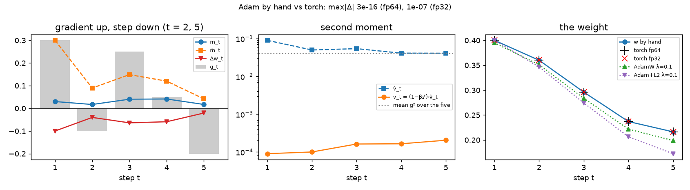
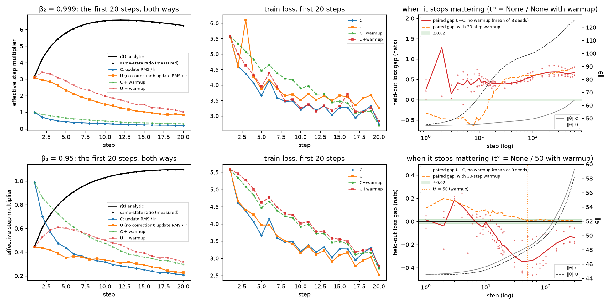
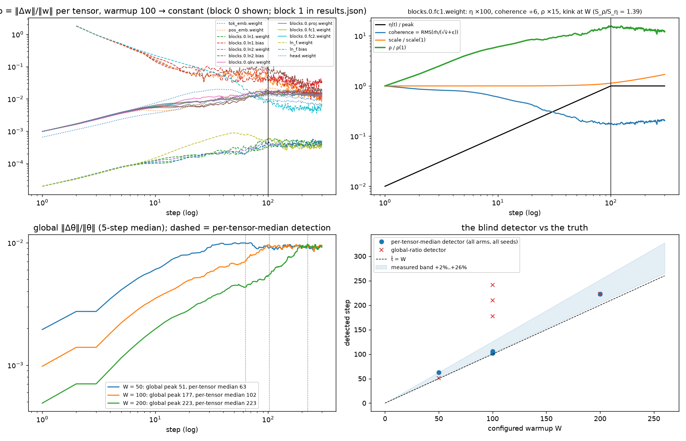
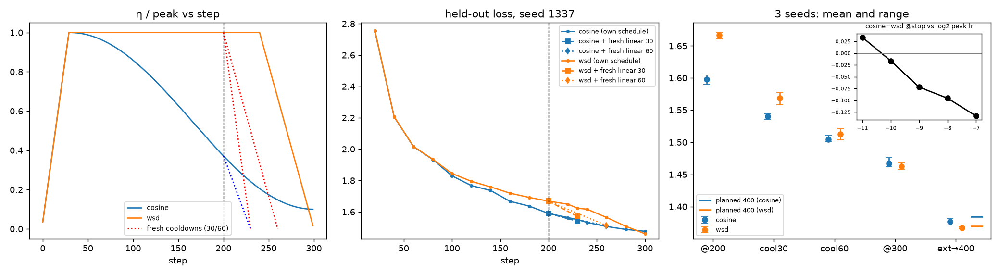
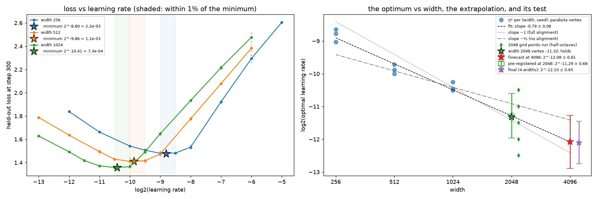
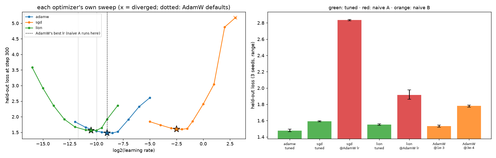

# Tune Both Sides — Adam by hand, schedules that lie at step 200, and a learning rate for a width you cannot afford

**Assignment 11 — optimizers and learning-rate schedules.** *"Tune both sides before
accepting a comparison. Almost every optimizer claim that failed to replicate was a well
tuned method measured against a badly tuned one."*

**One-page card for graders: [GRADERS.md](GRADERS.md). The notebook:
[`optimizers.ipynb`](optimizers.ipynb) — committed fully executed on this machine's CPU
(every by-hand check, float64) and GPU (every sweep, Apple MPS), runs top to bottom with
no downloads locally and one sha256-verified 1.3 MB fetch of the repo's own corpus in Colab.**

[](https://colab.research.google.com/github/shankarpandala/era-v5/blob/main/assignment-11/optimizers.ipynb)

Session 10 instrumented one step. This assignment is about the two things that decide
what a step *does* — the optimizer's arithmetic and the learning rate's trajectory — and
about the one discipline that makes any claim about either believable. All six required
tasks are *measured* on a real (small) byte-level transformer, and every claimed number
below is re-derived from the committed artifacts by an independent audit
([`audit.py`](audit.py), pure Python, no torch) that never executes the notebook:

> **Task 1 in one line:** one weight, five gradients, the textbook recursion in plain
> floats — and `torch.optim.Adam` agrees with every row to **3 × 10⁻¹⁶** in float64 and
> to **6 decimal places** in float32, checked *non-circularly* (PyTorch never stores m̂ or
> v̂; the realized step (w_{t−1}−w_t)/η and a β₁ = 0 run read them off torch's own
> behaviour). The same five numbers teach four things, each measured: the first step is
> ±η to 3 × 10⁻⁸ (and would be **3.162 η** without bias correction); scale invariance
> holds at ×1000 (1.2 × 10⁻⁸) and breaks on the way *down* (|u₁| = |g|/(|g|+ε): 0.23 at
> 10⁻⁸ scale); Keras' ε̂ and optax' `eps_root` differ from PyTorch's ε by 2.4 × 10⁻⁷ and
> 1.3 × 10⁻⁸ — one visible above the fp32 floor, one below; and **L2-in-Adam delivers
> 2.5× MORE decay than AdamW at the same λ** (λw is divided by √v̂ + ε, and √v̂ = 0.20 < 1),
> which halves ‖W‖ in 20 steps on the real model while AdamW moves it by the analytic
> (1−ηλ)²⁰.
>
> **Task 2 in one line:** from one state the uncorrected step is exactly
> r(t) = (1−β₁ᵗ)/√(1−β₂ᵗ) times the corrected one (measured to 1.2 × 10⁻² over 600 steps,
> the residual is ε) — **3.16× at step 1, peaking 6.57× at step 12, still 2× at step 300,
> within 10% only after step 1,751** for β₂ = 0.999, but **0.45× at step 1, peak 1.10× at
> step 20, within 10% from step 6** for β₂ = 0.95 (the crossover is β₂ = 1−(1−β₁)² = 0.99).
> Trained both ways from identical init and stream: at β₂ = 0.999 the early over-steps
> double the weight norm (125.7 vs 64.0) and the paired held-out gap is **+0.67 nats at
> step 600, plateaued at 0.65–0.68 from step 200 on** — it never stops mattering inside
> the run, with or without warmup, and corrected Adam run *hot for the first 30 steps
> only* reproduces the damage (+0.002 on the paired seed mean). At β₂ = 0.95 the
> difference stops mattering at **step 50** with the 30-step warmup (|gap| < 0.02, the
> pre-registered tolerance, for every later eval; max 0.018 at step 80); *without* warmup
> the uncorrected arm is behind for the first six steps (up to +0.18 at step 3) and then
> **ahead** from step 7, by 0.14–0.34 nats from step 15 to the end — its r(t) < 1 start is
> a warmup in disguise.
>
> **Task 3 in one line:** the update-to-weight ratio ρ = ‖Δw‖/‖w‖ of all 21 tensors, every
> step, decomposed as η(t) · coherence / scale (identities asserted: ρ(1)·σ_init/η(1) =
> 0.9945…1.0050 for every dense matrix, coherence(1) = 1); **warmup stops changing ρ at
> step W** — its contribution to the slope of log ρ is S_η = 1/W (measured 0.0105 at W = 100)
> and ends there by construction — and at this configuration the kink is *visible* in every
> block matrix (S_ρ/S_η = 0.89…2.97) and in the per-tensor peaks (102 / 106 / 103 for
> W = 100 across seeds, 223 for W = 200), while a counterfactual at width 128, η = 10⁻³
> reproduces the opposite regime (visibility **0.09**: coherence still falling when the
> ramp ends cancels it) — the decomposition transfers, the raw ratio does not. A
> pre-registered blind detector on the *global* ratio fails at W = 100 (177–241) and the
> failure is reported.
>
> **Task 4 in one line:** stopped at step 200, **cosine 1.5983 vs WSD 1.6666** (cosine lower
> by 0.068 in all three paired seeds; cosine is at 0.372 × peak there, WSD at the peak with
> 28% more learning-rate area) — **I would keep the cosine model**: still 0.024 better after
> both get a 30-step cooldown, 0.008 after 60; the WSD checkpoint's real advantage is that
> it is a horizon-agnostic trunk (its extension to 400 *is* a run planned for 400, and beats
> the re-warmed cosine checkpoint by 0.0095 in every seed) — so the answer flips only if
> the horizon may grow. And "cosine leads at 200" flips with the peak η (+0.033 at η/4,
> −0.017 at η/2, −0.133 at 4η): below the horizon's optimum WSD's extra area wins.
>
> **Task 5 in one line:** minima (parabola vertices per seed, three seeds, half-octave
> points) at **2⁻⁸·⁸⁰ = 2.2 × 10⁻³ (256), 2⁻⁹·⁸⁶ = 1.1 × 10⁻³ (512), 2⁻¹⁰·⁴¹ = 7.3 × 10⁻⁴ (1024)**;
> regression slope **−0.79 ± 0.08** (95% CI [−0.99, −0.60]: between the −1 and −½ exponents
> and excluding both — partial alignment); three-width forecast for 4,096: 2.31 × 10⁻⁴ with a
> ×1.75 band [1.3, 4.1] × 10⁻⁴ (regression prediction interval + grid term); the
> pre-registered test at width 2048 (102M params, five half-octave points: predicted
> −11.29 ± 0.68, measured vertex **-11.32**) **holds**, the four-width
> refit gives 2.28 × 10⁻⁴ (×1.57), and **I would use ≈ 2 × 10⁻⁴, inside [1.8, 2.3] × 10⁻⁴**:
> the notebook's mechanical rule (half-way down the band, because at width 1024 ×2 costs
> +9.9% and ÷2 only +4.4%) gives 1.8 × 10⁻⁴, but the asymmetry *reversed* at 2048
> (÷2 +7.7%, ×2 +3.5%), so shading low is prudence, not measurement. Confidence: the ×1.57
> band at 95%, not the value; and the optimum moves −0.28 octaves per doubling of the horizon.
>
> **Task 6 in one line:** each optimizer given its own sweep and confirmed on three seeds it
> never saw: **AdamW 1.4774, SGD+Nesterov 1.5906, Lion 1.5505** — AdamW wins by 0.113 and
> 0.073 (pooled range 0.032). The naive comparison run *both* ways: a careless port
> (challenger at AdamW's η) exaggerates the deficits **12×** and 6×; the requirement's
> direction (tuned challenger vs AdamW at a default η) **manufactures a false positive** —
> "Lion beats Adam by 0.23, SGD by 0.19" at the 3e-4 default, "Lion matches Adam" at 1e-3.
> Clipping at 1.0, chosen for AdamW and inherited, binds on 46–60% of every arm's steps;
> removing it at the clipped optima costs AdamW +0.035, Lion +0.119, SGD +1.38, and SGD
> re-tuned without the clip reaches 1.7950 at 2^-4.5 (vs 1.5988 clipped, same seed: the clip is worth +0.196); weight decay had to be matched as
> η·λ (λ = 0.1 as a decoupled shrink in SGD's units costs +0.26). `fair_compare()` refuses to
> call a winner on a grid edge, a config or data mismatch, or inside the noise.

```bash
cd assignment-11
pip install -r requirements.txt
python run_demo.py --verify-only   # ~2 s: independent audit of the committed artifacts
python run_demo.py --fast          # ~2 min smoke run, reduced budgets, same pipeline
python run_demo.py                 # full re-run on CPU + accelerator; --resume reuses cached sweep runs
python -m pytest tests -q          # 27 invariant tests (they exec the notebook's cells)
```

**Definition of done** (all three green): `pytest` passes, `--verify-only` prints
`verdict: PASS` (122 audit checks; one pre-registered check fails and is recorded as
an acknowledged failure, §3), and every number the audit lists is re-derived from
[`submission_artifacts/results.json`](submission_artifacts/results.json) — this README is
hand-synced to those numbers and was cross-checked by a second adversarial review pass;
training outcomes are audited as orderings with margins above the measured replicate and
seed spreads, never as GPU floats verbatim (the Session-9/10 convention).

---

## Requirement checklist

| # | requirement | where | the answer |
|---|---|---|---|
| 1 | Adam by hand: one weight, five gradients, m, v, m̂, v̂, the step; check each against PyTorch to several decimals | §1 | table of five rows; fp64 agreement **3 × 10⁻¹⁶**, fp32 **6 decimals**, non-circular (realized step + β₁ = 0 run) |
| 2 | disable bias correction, plot the first twenty steps both ways, report when the difference stops mattering | §2 | plotted (multiplier, loss, warmup twin); **β₂ = 0.95 + warmup: step 50**; β₂ = 0.95 no warmup: the uncorrected arm *leads* throughout; **β₂ = 0.999: never** (+0.67 at 600, weight norm doubled) |
| 3 | log the update-to-weight ratio for every layer; identify the step at which warmup stops changing it | §3 | 21 tensors + 5 pooled layers, every step; **step W = 100** for the W = 100 arm (S_η ≈ 1/W ends there in every tensor; per-tensor peaks 102/106/103 at W = 100, 223 at W = 200); block-matrix visibility 1.48 / 1.64 / 2.27 across seeds here vs 0.09 at width 128, η = 10⁻³ |
| 4 | train twice for 300 steps, cosine and WSD, stop both at 200, report both losses, say which to keep | §4 | **cosine 1.5983, WSD 1.6666** (3 paired seeds, unanimous); **keep cosine** (unless the horizon may grow: then the WSD trunk, by 0.0095 at 400) |
| 5 | sweep lr at widths 256/512/1024, plot loss vs lr, mark the three minima, state the value at 4,096 and the confidence | §5 | minima 2⁻⁸·⁸⁰ / 2⁻⁹·⁸⁶ / 2⁻¹⁰·⁴¹ marked; **4,096: use ≈ 2 × 10⁻⁴, inside [1.8, 2.3] × 10⁻⁴** (3 widths: point 2.31 × 10⁻⁴, ×1.75 band, slope −0.79 ± 0.08; 4 widths after the 2048 test holds: 2.28 × 10⁻⁴, ×1.57) |
| 6 | tune both sides before accepting a comparison | §6 | both naive directions vs fair: naive B manufactures "Lion/SGD beat Adam" at a 3e-4 baseline; fair: AdamW wins by 0.073 / 0.113; clip disclosed and SGD re-tuned without it (1.7950 at 2^-4.5 (vs 1.5988 clipped, same seed: the clip is worth +0.196)); decay matched as η·λ; `fair_compare()` refuses on edge / config / noise |
| + | use local compute: CPU and GPU | §0b | CPU fp64 checks + MPS sweeps; 20-step agreement 1.7 × 10⁻⁷, MPS replicate bitwise, 300-step divergence 0.0041 < seed spread 0.0419 |
| + | detailed README with support code | this file | `optimizers.ipynb`, `run_demo.py`, `audit.py` (122 checks), 27 tests, `GRADERS.md` |

The notebook is the primary artifact and carries the same story cell by cell. Seven
adversarial design reviews ran *before* a line of it was written (§8) — several sections
exist in their present form because a reviewer's measurement destroyed the first design.

---

## 1. Adam by hand (§1)

The five gradients are +0.30, −0.10, +0.25, +0.05, −0.20 on w₀ = 0.5 with η = 0.1,
β = (0.9, 0.999), ε = 10⁻⁸. The table the notebook prints (10 decimals; audited row by
row against an independent implementation) reads, at the last step,
m₅ = 0.0171430000, v₅ = 0.0002044831, m̂₅ = 0.0418622256, v̂₅ = 0.0409785015,
u₅ = m̂/(√v̂+ε) = 0.2067970102, Δw₅ = −0.0206797010, w₅ = 0.2162920353. What the table
teaches, read off it: the gradient says *up* at t = 2 and t = 5 and Adam still steps
*down* (−0.0400, −0.0207) — momentum outvotes one gradient; v̂₅ = 0.04098 is the plain
mean of g² (0.04100) because β₂ = 0.999 makes v̂ a running mean, so √v̂₅ = 0.2024 is the
gradient RMS; m̂₅ = 0.042 is the β₁-weighted *recent* mean of g (the plain mean is 0.060),
so the late step is η · (recency-weighted mean of g)/RMS(g) — a signal-to-noise step.

**The check against PyTorch, done honestly.** `torch.optim.Adam` holds only `step`,
`exp_avg` and `exp_avg_sq`; m̂ and v̂ are folded into the step size and the denominator
and never stored, so "compare torch's m̂" would compare the hand formula with itself.
Instead: m and v against the state; u against the realized step (w_{t−1} − w_t)/η; √v̂
read off a second torch run with β₁ = 0 (its realized step is g/(√v̂+ε)); m̂ from u and
that √v̂. Float64: every quantity within **3.3 × 10⁻¹⁶** absolute (w: exactly 0.0).
Float32: within 1.1 × 10⁻⁷ absolute, relative errors 6 × 10⁻⁸ … 3.5 × 10⁻⁷ — **six decimal
places**, which is "several" measured rather than asserted. Torch's default
single-tensor path is used (`foreach=False`); the fused kernel on the accelerator loses
another decimal because it forms 1 − β₂ in fp32 (0.999 is not fp32-representable:
relative error 1.3 × 10⁻⁵, exactly the error measured in v).

| lesson | measured |
|---|---|
| first step is ±η whatever the gradient | \|Δw₁\| = η × (1 − 3.3 × 10⁻⁸), the deviation = ε/\|g₁\| exactly; **uncorrected** it would be 3.16228 η = (1−β₁)/√(1−β₂) — the bridge into §2 |
| scale invariance, and where it breaks | max \|w_k − w\| over the five steps (a trajectory deviation, not a step size): ×1000: 1.2 × 10⁻⁸; ×10⁻³: 1.2 × 10⁻⁵; ×10⁻⁶: 1.1 × 10⁻² and \|u₁\| = 0.968; ×10⁻⁸: 0.23 and \|u₁\| = 0.231 = \|g₁\|/(\|g₁\|+ε) (closed form, asserted at every rung) |
| where ε sits | PyTorch m̂/(√v̂+ε); Keras/TF ε̂ = ε/√(1−β₂ᵗ) added instead (differs by 2.4 × 10⁻⁷ on these five numbers — *above* the 1.8 × 10⁻⁸ fp32 floor, a port would see it); optax `eps_root` inside the root (1.3 × 10⁻⁸, below it). At \|g\| ≈ 10⁻⁸ the first \|u\| is 0.231 / 0.009 / 3 × 10⁻⁵ — three optimizers all called Adam |
| AdamW vs Adam-with-L2, λ = 0.1 | both by hand match `torch.optim.AdamW` and `torch.optim.Adam(weight_decay)` to ≤ 2.8 × 10⁻¹⁷ (and `Adam(decoupled_weight_decay=True)` ≡ AdamW bitwise); decay *delivered* after five steps: AdamW 0.0175, L2 **0.0439 — 2.5× more**, because λw rides through m̂/(√v̂+ε) and √v̂ ≈ 0.20 < 1 amplifies it |

On the real model (§1's last cell, 20 steps at η = 10⁻³, same init and stream) the same
contrast at scale: AdamW moves ‖W‖ below the no-decay run by the analytic
(1−(1−ηλ)²⁰)‖W‖, while L2-in-Adam **shrinks ‖W‖ by ~half** — the same λ is a different
unit, which is the reason AdamW exists (numbers in [`results.json`](submission_artifacts/results.json) → `adam_by_hand.decay.real_model`).



## 2. Bias correction off — the first twenty steps both ways (§2)

**The arithmetic first.** From the same m, v the uncorrected step is r(t) times the
corrected one per coordinate, r(t) = (1−β₁ᵗ)/√(1−β₂ᵗ). Exact values (audited):

| β₂ | r(1) | r(2) | r(5) | r(10) | peak | r(20) | r(100) | r(300) | r(1000) | stays within 10% from | within 1% from |
|---|---|---|---|---|---|---|---|---|---|---|---|
| 0.999 | 3.162 | 4.250 | 5.797 | 6.528 | **6.569 @ 12** | 6.241 | 3.241 | 1.964 | 1.258 | **1,751** | 3,925 |
| 0.99 | 1.000 | 1.347 | 1.850 | 2.106 | 2.131 @ 13 | 2.059 | 1.256 | 1.025 | 1.000 | 175 | 391 |
| 0.95 | **0.447** | 0.608 | 0.861 | 1.028 | 1.097 @ 20 | 1.097 | 1.003 | 1.000 | 1.000 | **6** | 76 |

The naive expectation — "correction is a first-few-steps thing" — is true only at
β₂ = 0.95, and there the first step is 2.2× too *small*, not too large: r(1) = 1 exactly
at β₂ = 1−(1−β₁)² = 0.99; above it m fills faster than v and the uncorrected optimizer
runs hot, below it the reverse.

**The instrument.** `HandAdamW` reproduces `torch.optim.AdamW` in the same op order:
**bitwise** identical after 20 steps of the real model on CPU fp32, on CPU fp64, and on
MPS fp32. It exposes the switch torch does not. Two measurements, labelled
for what they are: (a) *one* trajectory computing both updates from its own state every
step — the RMS ratio equals r(t) to 1.2 × 10⁻² over 600 steps (step 1: 3.1228 vs 3.1623,
step 12: 6.5608 vs 6.5685; the residual is ε at near-zero-gradient coordinates); (b) *two*
trajectories from identical init and a checksummed identical stream, each arm's effective
step multiplier (update RMS ÷ η) plotted separately — because the ratio of two
independent arms is *not* r(t): the hotter arm's gradients decorrelate and its normalized
update shrinks (measured U/C 4.70 / 4.13 / 2.85 at t = 10 / 20 / 50 vs r = 6.53 / 6.24 / 4.50).

**Trained both ways** (width 256, constant η = 2⁻⁹, 600 steps at β₂ = 0.999 and 300 at
0.95, three paired seeds, every held-out byte scored):

| β₂ | pair | held-out gap U − C | when it stops mattering |
|---|---|---|---|
| 0.999 | no warmup | +0.23 (t=1), +0.53 (10), +0.41 (20), +0.58 (100), +0.68 (250), **+0.67 (600)** | **never inside the run** (plateau 0.65–0.68 from step 200); ‖θ‖ 125.7 vs 64.0 at 600 |
| 0.999 | 30-step warmup | −0.33 (1) … −0.52 (10), +0.22 (20), +0.63 (200), **+0.75 (600)** | never; warmup delays the crossover to t ≈ 15 and changes nothing after |
| 0.95 | 30-step warmup | +0.11 (1), +0.05 (20), +0.04 (30), +0.022 (40), **+0.009 (50)**, +0.018 (80), +0.015 (100), +0.008 (300) | **step 50** — the first eval (10-step grid) after which \|gap\| < 0.02 at every later eval; the residual (+0.01 on the seed mean) is *mixed in sign* across seeds, i.e. indistinguishable from zero |
| 0.95 | no warmup | +0.01 (1), +0.18 (3), +0.02 (6), −0.20 (20), −0.34 (50), −0.26 (100), **−0.14 (300)** | never — behind for six steps, then the *uncorrected* arm leads from step 7 (seed range at 300: 0.06–0.19): r(t) < 1 for the first eight steps is a warmup in disguise |

Three stated criteria give three honest answers. Analytic (|r−1| < 10%): 1,751 steps at
β₂ = 0.999, 6 at 0.95. Measured multipliers within 10% for 20 consecutive steps: never
within 600 at 0.999, step 35 at 0.95. Loss (paired, an absolute 0.02 nats ≈ 1% of the loss
at t*): step 50 at 0.95 with warmup, never at 0.999. **The mechanism at 0.999 is not divergence** (no run NaN'd —
clip 1.0, Adam's bounded step and pre-LN make that unreachable): the 3–6× over-steps of
the first ~100 steps inflate the weight norm, which under pre-LN is a permanently lower
effective learning rate that weight decay (0.1 × η per step) cannot undo. Two
counterfactuals pin it: corrected Adam driven at 6.57 × η for the first 30 steps then back
lands within 0.101 nats of the uncorrected arm in every seed (C-hot − U = -0.010, -0.084, +0.101; mean +0.002) — the damage is the early magnitude — and the uncorrected arm at η/3 (1.732 vs 1.640, one seed) — the multiplier is an η boost, so
below the optimum dropping correction *helps* and above it hurts: U-vs-C is a
learning-rate comparison in disguise. The plotted first twenty steps are the effective
step multiplier with r(t) drawn through it, the train loss both ways (plus the warmup
twin), and the paired gap over the whole run with ‖θ‖ on the right axis:



## 3. The update-to-weight ratio of every layer, and the step where warmup lets go (§3)

For every parameter tensor and every step, ρ = ‖Δw‖/‖w‖ — the fraction of itself a layer
rewrote — logged for 300 steps of the width-256 model with linear warmup over
W ∈ {50, 100, 200} then constant η = 2⁻⁹ (three seeds at W = 100), together with the parts
that compose it under AdamW: ρ = η(t) · coherence / scale (+ the decoupled-decay term
ηλ‖w‖, separated: 1–2% of ‖Δw‖ at W, which shifts ‖Δw‖ by at most 0.8%, the head). Three identities pin the instrument, all
asserted: at step 1 every coordinate of a dense matrix moves by exactly ±η, so
ρ(1)·σ_init/η(1) = 0.9945…1.0050 across the matrices and coherence(1) = 0.9957…0.9999
(tok_emb: 0.6632, vs √(rows touched by the first batch / 259) = √(114/259) = 0.6634); LayerNorm gains have
RMS 1, so ρ(1)/η(1) = 1.0008; and ‖Δw_adam‖ = η·‖m̂/(√v̂+ε)‖ to 1.7 × 10⁻⁵ at peak η
(1.0 × 10⁻³ in the first five steps, where η(t) ≈ 2 × 10⁻⁵ makes Δw a 10⁻⁵ fraction of w and
fp32 subtraction bites — a measurement limit, reported as one).

**The step at which warmup stops changing ρ is W — step 100 for the W = 100 arm (50 and
200 for the others) — and the slope-change metric confirms it in every block matrix.**
Warmup's contribution to the slope of log ρ is S_η ≈ 1/W (measured 0.0105 = 1/95.5 over
the 10-step window at W = 100, for every tensor, from the committed η trace) and it ends at
step W by construction; the ratio's own *peak* sits on W in only about half the tensors,
and not in the global ratio. The per-layer
attribution at W = 100 (slopes over the 10 steps before minus after W):

| tensor | ρ(1) | ρ(W) | ρ(300) | coherence(W) | S_η | S_r | S_ρ | S_ρ/S_η | peak of ρ |
|---|---|---|---|---|---|---|---|---|---|
| tok_emb | 6.5e-4 | 1.3e-2 | 9.2e-3 | 0.157 | 0.0105 | −0.0009 | 0.0095 | 0.91 | 99 |
| pos_emb | 9.7e-4 | 2.2e-2 | 1.3e-2 | 0.215 | 0.0105 | +0.0097 | 0.0202 | 1.92 | 102 |
| block0 qkv | 9.7e-4 | 1.8e-2 | 1.3e-2 | 0.200 | 0.0105 | −0.0012 | 0.0093 | 0.89 | 99 |
| block0 proj | 9.8e-4 | 1.8e-2 | 1.8e-2 | 0.178 | 0.0105 | −0.0002 | 0.0103 | 0.98 | 285 |
| block0 fc1 | 9.7e-4 | 1.5e-2 | 1.2e-2 | 0.176 | 0.0105 | +0.0041 | 0.0146 | 1.39 | 100 |
| block0 fc2 | 9.7e-4 | 1.4e-2 | 1.2e-2 | 0.162 | 0.0105 | +0.0033 | 0.0138 | 1.32 | 124 |
| block1 qkv | 9.7e-4 | 1.8e-2 | 1.4e-2 | 0.196 | 0.0105 | +0.0205 | 0.0311 | 2.97 | 96 |
| block1 fc1 | 9.8e-4 | 1.4e-2 | 1.2e-2 | 0.162 | 0.0105 | +0.0054 | 0.0159 | 1.52 | 102 |
| ln_f gain | 2.0e-5 | 5.6e-4 | 3.3e-4 | 0.301 | 0.0105 | +0.0319 | 0.0423 | 4.04 | 50 |
| head | 9.8e-4 | 9.6e-3 | 6.8e-3 | 0.169 | 0.0105 | +0.0007 | 0.0111 | 1.06 | 36 |
| LN biases | — (‖b‖ = 0 at init) | 3–8e-2 | 1–3e-2 | ~0.1 | 0.0105 | — | — | — | — (monotone from step 2; excluded) |

(full table for all 21 tensors in the notebook and `results.json → update_ratio.attribution`.)
In this seed every block matrix shows the kink at W with S_ρ/S_η between 0.89 and 2.97
(mean 1.48); across the three W = 100 seeds the block matrices' seed means are 1.48 / 1.64 / 2.27
and 7 of the 8 exceed 0.5 in every seed (blocks.0.qkv: 0.89/0.30/1.66) — the 10-step slopes are noisy
per seed, so the claim is about the group, not each tensor. The ramp is not cancelled here;
where S_r > 0 the kink is *sharper* than the ramp alone, because once η stops rising the
coherence starts falling faster. The pre-implementation review had
measured the opposite regime at width 128 and η = 10⁻³ (coherence still falling while
the ramp rises, S_r ≈ −S_η, no kink in the hidden matrices' ρ); that configuration is run
in the notebook as a counterfactual arm: at width 128, η = 10⁻³, W = 50 the block matrices' S_ρ/S_η is −0.38…+0.41 (mean **0.09**) — the ramp is cancelled (fc1: S_η +0.022, S_r −0.014, coherence at W 0.213 and still falling) — while the same code at width 256, η = 2⁻⁹ gives **1.48**. The lesson that transfers is
the decomposition, not the raw ratio: whether a layer's ρ *shows* the end of warmup
depends on where its coherence decay sits relative to the ramp.

**Two blind detectors, pre-registered, one of which fails.** Each is the first argmax of a
centered 5-step running median over steps ≥ 10 (exactly W on a synthetic ramp-then-flat
series — a test).
On the *global* ratio ‖Δθ‖/‖θ‖ it lands at 51 for W = 50 and 223 for W = 200 but at
177 / 241 / 210 for the three W = 100 seeds: the global ratio has no sharp peak at 100 —
some tensors (block0 proj, block1 LayerNorms) keep rising to steps 248–293 — so its argmax
wanders over a plateau. The *median over tensors of each tensor's own peak* lands
at 63 for W = 50, at 102 / 106 / 103 for the three W = 100 seeds, and at 223 for W = 200. That detector's measured band is +2%…+26% — one arm (W = 50, +26%) misses the pre-registered ±25%, which the audit records as an acknowledged failure rather than a pass across five arms; the
global one's is +2%…+141%, and the failure is reported, not hidden.

**"≈1e-3" is arithmetic, not a law.** ρ(1) = η(1)/σ_init for every dense matrix, and at W
the block matrices sit at ρ = 1.4–1.8 × 10⁻² = η · coherence / scale with η = 2 × 10⁻³,
coherence ≈ 0.16–0.20 and RMS(w) ≈ 0.02: the rule of thumb assumes η ≈ 3 × 10⁻⁴ and
larger weights. Outliers by mechanism: LayerNorm gains sit 30× below the matrices because
RMS(gain) = 1; LayerNorm biases start at exactly zero (ρ undefined at step 1, then 1.82,
0.95, 0.64 — a norm-growth regime with no warmup signature); the head's scale grows 3.0×
over the run, so its ρ peaks at step 36 and falls through W. Pooled per *layer* (the
requirement's word), ρ at step 1 / 100 / 300: embeddings 7.7e-4 / 1.6e-2 / 1.0e-2,
block 0 6.0e-4 / 1.0e-2 / 9.7e-3, block 1 6.0e-4 / 9.8e-3 / 1.0e-2, ln_f 2.8e-5 / 6.5e-4 /
4.4e-4, head 9.8e-4 / 9.6e-3 / 6.8e-3. And ρ forgets W: fc1 at step 20 reads
1.24e-2 / 8.2e-3 / 4.8e-3 for W = 50 / 100 / 200 and 1.08e-2 / 1.17e-2 / 1.27e-2 at step 300.



## 4. Cosine vs WSD for 300 steps, both stopped at 200 (§4)

Identical init, checksummed identical stream, peak η = 2⁻⁹, warmup 30; cosine decays to
10% of the peak at 300, WSD holds the peak until 240 then decays linearly to zero. At
step 200 cosine's 200th update used **0.377 × peak** (0.372 × on the next step, where the
cooldowns start) and WSD is at the peak; WSD has 28% more
learning-rate area by then (185.5 vs 144.8 peak-units). Every held-out byte scored,
three paired seeds, per-seed differences (cosine − WSD) with their sign agreement:

| | cosine | WSD | cosine − WSD per seed | sign |
|---|---|---|---|---|
| **stopped at step 200** | **1.5983** | **1.6666** | −0.0784, −0.0659, −0.0606 | unanimous |
| own schedule to 230 | 1.5462 | 1.6253 | −0.073, −0.071, −0.093 | unanimous |
| fresh linear cooldown, 30 steps → 230 | 1.5401 | 1.5690 | −0.030, −0.023, −0.034 | unanimous |
| fresh (1−√) cooldown, 30 steps → 230 | 1.5424 | 1.5641 | −0.023, −0.019, −0.024 | unanimous |
| fresh linear cooldown, 60 steps → 260 | 1.5047 | 1.5125 | −0.003, −0.003, −0.018 | unanimous |
| fresh (1−√) cooldown, 60 steps → 260 | 1.5121 | 1.5137 | +0.004, −0.001, −0.008 | mixed |
| own schedule to 300 (the planned horizon) | 1.4672 | 1.4622 | +0.016, +0.005, −0.006 | mixed |
| extended to 400 (WSD: peak then decay; cosine: re-warm, peak, same decay) | 1.3763 | 1.3668 | +0.012, +0.011, +0.006 | unanimous |
| train loss, mean of steps 191–200 | 1.5965 | 1.6689 | −0.072, −0.074, −0.072 | unanimous |

**The two losses at step 200: cosine 1.5983, WSD 1.6666** (cosine lower by 0.068 on
average, 0.061–0.078 per seed, every seed agrees). **The model I would keep: the cosine one** — if the run is over, it is
0.068 nats better; if 30 more steps can be afforded it is still 0.024 better after both
get their best fresh cooldown, and 0.008 better after 60. The WSD checkpoint's claim to
fame is real but conditional: it is a horizon-agnostic trunk — its extension to 400 is
*identical* to a WSD run planned for 400 from scratch (same warmup, same peak through
200, same data: seed 1337 gives 1.3694 both ways, by construction), and it beats the
re-warmed cosine checkpoint at 400 by 0.0095 in all three seeds; the re-warmed cosine
checkpoint itself lands within 0.003 of a cosine run planned for 400, so "the cosine
checkpoint cannot be extended" is *not* true, it just extends slightly worse. So: keep
cosine unless the horizon may grow, in which case keep the WSD trunk — and the numbers
are the size of "unless": 0.068 now, 0.0095 later.

**"Cosine leads at 200" is a regime, not a property of the schedules.** Across a
five-point ladder of peak η (two seeds each), the step-200 gap cosine − WSD reads
**+0.033** at η/4 (WSD leads), −0.017 at η/2, −0.072 at η, −0.096 at 2η, −0.133 at 4η:
WSD leads at the stop only once the peak is far enough below cosine's optimum (here about
3× below — the sign flips between η/4 and η/2); there the remaining steps are
progress-limited and WSD's extra learning-rate area wins, while from η/2 upward cosine
leads and the gap widens monotonically with η. Tune-both-sides applies to schedules too: at the stop
step each schedule's own best peak is 2⁻⁹ for cosine and 2⁻¹⁰ for WSD, and at each one's
own best cosine still leads by 0.054. At the full 300 the two are inside the noise
(WSD by 0.005, mixed sign), and the cosine-to-zero control (1.4977 vs 1.4760 for cosine
to 10%) shows the floor *helps* cosine here — the last ~60 cosine steps at ≤ 0.2 × peak
are too small to be worth spending at this horizon — so WSD ≥ cosine at the planned
horizon is expected, not a floor artifact. (Whether a run is noise- or progress-limited
depends on η *and* on the steps remaining, not on η alone.)



## 5. The learning-rate sweep at widths 256, 512, 1024 — and the value at 4,096 (§5)

Standard parametrization, two layers, heads of 64, B = 16, T = 128, 300 steps with 30
warmup + cosine to 10%, AdamW (0.9, 0.95), λ = 0.1, clip 1.0; the coarse grid is powers of
two (2⁻¹²…2⁻⁵ at 256, 2⁻¹³…2⁻⁶ at 512 and 1024), two seeds each, then the two half-octave
points around each argmin (both seeds) and a third seed at the argmin and its neighbours —
71 runs, every held-out byte scored at step 300. **Nothing diverged**, even at 2⁻⁵ with
clip 1.0: the top of every curve is a loss cliff, not NaN.

| width | params | grid argmin | per-seed argmin | **vertex η\*** (log₂; per seed) | fit minimum | seed spread | ÷2 / ×2 penalty around the argmin | 1%-basin (log₂) |
|---|---|---|---|---|---|---|---|---|
| 256 | 1,740,800 | 2⁻⁹ | −9, −8.5, −9 | **−8.80** = 2.2e-3 [−8.78, −8.65, −9.03] | 1.4769 | 0.032 | +4.2% / +3.6% | [−9.0, −8.5] |
| 512 | 6,627,328 | 2⁻¹⁰ | −10, −9.5, −10 | **−9.86** = 1.1e-3 [−10.00, −9.72, −9.88] | 1.4099 | 0.056 | +5.9% / +4.5% | [−10.0, −9.5] |
| 1024 | 25,837,568 | 2⁻¹⁰·⁵ | −10.5, −10, −10 | **−10.41** = 7.3e-4 [−10.51, −10.25, −10.46] | 1.3572 | 0.015 | **+4.4% / +9.9%** | [−10.5, −10.0] |

The three minima are the starred points on the plot. A grid argmin is quantized to the
grid — at width 1024 the two best points differ by 0.5%, less than the 0.015-nat (1.1%)
seed spread —
which is why the estimator is the parabola vertex in log₂η through each seed's three
points closest to the minimum: it moves 0.25–0.38 octaves across seeds where the argmin
jumps by a whole one. The argmin is the same at 75% and 100% of the run at 512 and 1024
(at 256 it moves by one half-octave point), and the pre-registered workhorse η = 2⁻⁹ sits
0.2 octaves from the width-256 vertex.

**The extrapolation, and how confident.** Regressing log₂η\* on log₂width over the nine
(width, seed) vertices: **slope −0.794 ± 0.082** (95% CI [−0.99, −0.60]). That lies
*between* the two theoretical exponents — −1 for standard parametrization with Adam under
full gradient alignment (Tensor Programs V), −½ under no alignment (Everett et al. 2024)
— and the interval excludes both, marginally with three widths and clearly with four:
the measured exponent is a partial-alignment one, which is what Everett et al. report
empirically. Prediction at width 4,096: **log₂η = −12.08 → 2.31 × 10⁻⁴**;
the regression's 95% prediction interval is ±0.77 octaves (t = 2.365 on 7 dof), the
half-octave grid adds ±0.25 in quadrature → **±0.81 octaves, a ×1.75 band each way:
[1.3 × 10⁻⁴, 4.1 × 10⁻⁴]**. The systematic bracket from the width-1024 vertex over two
doublings is 1.83 × 10⁻⁴ (slope −1) to 3.67 × 10⁻⁴ (slope −½) — the "2× band" *is* the gap
between the two theories. And the basin is asymmetric where it matters: measured around
each width's argmin (a first draft measured it around a *rounded* neighbour and read
0.6% / 20.8% at 1024 — an artefact of Python's banker's rounding of −10.5, caught in
review), undershooting by 2× costs +4.4% and overshooting +9.9% at width 1024,
but +7.7% / +3.5% at 2048 — the *other* way — while at 256 and 512 the two sides are
within a point of each other. So the data do not support a consistent asymmetry; the
notebook's pre-registered rule still shades the recommendation to the low side of the
band, and the README says plainly that this is prudence (overshooting is the failure mode
that diverges), not a measured effect.

**The prediction, tested one doubling out.** Before any width-2048 run, the fit's value
for 2048 and its interval were written to `results.json`: log₂η = **−11.29 ± 0.68**, with the
pass criterion: five runs at half-octave spacing around the predicted half-octave (the
resolution every fitted width had — with three whole-octave points the vertex is confined
to ±½ octave of the middle point and the test could not fail), the parabola vertex through
the argmin and its two neighbours inside the interval, and the loss at the predicted
half-octave within 1% of the best of the five. Measured: 2^-12.5: 1.4152, 2^-12: 1.3548, 2^-11.5: **1.3141**, 2^-11: 1.3205, 2^-10.5: 1.3606, vertex
**-11.32** — the prediction **holds** (102M parameters, one seed,
15 min on MPS). Refit with four widths: slope -0.800 ± 0.061, width 4,096 →
**2.28 × 10⁻⁴ (±0.65 octaves, ×1.57)**; the three-width forecast
(2.31 × 10⁻⁴, ×1.75) is kept beside it as the pre-registered number.

**The value I would use at width 4,096, for this recipe: η ≈ 2 × 10⁻⁴, anywhere in
[1.8, 2.3] × 10⁻⁴** — the notebook's mechanical rule (half-way down the band from the
2.28 × 10⁻⁴ point estimate) prints 1.8 × 10⁻⁴; the point estimate itself is 2.3 × 10⁻⁴; the
measured asymmetry that would pick between them did not replicate at 2048, so the choice
inside that range is prudence. Confidence, in three separate statements: I would bet on
the ×1.57 band around 2.28 × 10⁻⁴ at 95% (four widths; ×1.75 around 2.31 × 10⁻⁴ from the
three the requirement asked for); I would not bet on the third significant digit; and the
fit itself sits nearer the slope −1 end (1.8 × 10⁻⁴) than the −½ end (3.7 × 10⁻⁴) of the
theory bracket. The recipe
matters as much as the width: at width 256 the optimum
moves **−0.28 octaves per doubling of the horizon** (vertex −8.44 / −8.78 / −9.17 at 100 /
300 / 600 steps), so a 4,096-wide model trained ten times longer would want roughly half
this value again.



## 6. Tune both sides before accepting a comparison (§6)

Two challengers to the tuned AdamW of §5 at width 256: SGD with Nesterov momentum 0.9, and
Lion (implemented in twelve lines; checked against a float64 transcription of Chen et al.
2023's Algorithm 2 over 20 steps with gradient scales from 10⁻¹⁰ to 10⁹ — max |Δw|
5.3 × 10⁻¹⁵ — and the common mis-ordered port, momentum updated before the interpolation,
differs by 2 × 10⁻³; `HandSGD` is bitwise `torch.optim.SGD` at weight decay 0 — its decay
is decoupled by design, unlike torch's coupled L2). Same data, schedule shape,
steps, warmup and clip for every arm; one decay convention for all three — the per-step
shrink η·λ matched to AdamW's — because "λ = 0.1" is not a number that transfers (measured:
SGD with λ = 0.1 applied as a decoupled shrink in its own η units reads 1.857 vs 1.599 matched). Each optimizer got its own
sweep (10–11 tuning runs: a power-of-two grid, then the half-octaves around the argmin,
selection seed 1337), and the argmin was then **confirmed on three seeds the selection never
saw** (1338–1340):

| optimizer | own best η | tuning runs | 1%-basin | 3 fresh seeds (mean [range]) | clip binds |
|---|---|---|---|---|---|
| AdamW | 2⁻⁹ = 1.95 × 10⁻³ | 10 | [2⁻⁹, 2⁻⁸·⁵] | **1.4774** [1.4636, 1.4954] | 60% of steps |
| SGD + Nesterov | 2⁻²·⁵ = 0.177 | 11 | [2⁻²·⁵, 2⁻²] | **1.5906** [1.5848, 1.5972] | 48% |
| Lion | 2⁻¹⁰·⁵ = 6.9 × 10⁻⁴ | 11 | [2⁻¹⁰·⁵, 2⁻¹⁰] | **1.5505** [1.5415, 1.5598] | 46% |

**The same three optimizers, compared three ways** (held-out loss at 300, three seeds):

| comparison | AdamW | challenger | gap | what a paper would say |
|---|---|---|---|---|
| naive A: SGD at *AdamW's* η | 1.4774 | 2.8343 | +1.357 | "SGD is 92% worse" |
| naive B: *tuned* SGD vs AdamW at the 1e-3 default | 1.5338 | 1.5906 | +0.057 | "SGD trails slightly" |
| naive B: tuned SGD vs AdamW at the 3e-4 default | 1.7800 | 1.5906 | **−0.189** | **"SGD beats Adam on transformers"** |
| **fair**: SGD at its own η, fresh seeds | 1.4774 | 1.5906 | **+0.113** | AdamW wins (pooled range 0.032) |
| naive A: Lion at AdamW's η | 1.4774 | 1.9146 | +0.437 | "Lion is 30% worse" |
| naive B: tuned Lion vs AdamW at 1e-3 | 1.5338 | 1.5505 | +0.017 | "Lion matches Adam" |
| naive B: tuned Lion vs AdamW at 3e-4 | 1.7800 | 1.5505 | **−0.229** | **"Lion beats Adam"** |
| **fair**: Lion at its own η, fresh seeds | 1.4774 | 1.5505 | **+0.073** | AdamW wins (pooled range 0.032) |
| fair: SGD vs Lion | 1.5906 | 1.5505 | −0.040 | Lion wins (pooled range 0.018) |

Read the two naive rows for each challenger together and the requirement's sentence
stops being a slogan: the *same* tuned Lion "beats Adam by 0.23" against a 3e-4 baseline,
"matches Adam" against a 1e-3 baseline, and loses by 0.073 — more than twice the pooled
three-seed range — once the baseline is tuned; naive A (a careless port keeping AdamW's η)
exaggerates SGD's real deficit twelve-fold (1.357 vs 0.113) and Lion's six-fold (0.437 vs
0.073). The direction the requirement describes — a well-tuned new method against a
default baseline — is naive B, and it manufactures a *false positive* at the most common
default in the literature. `fair_compare()` is the protocol as code: it refuses to name a
winner when either optimum sits on a grid edge, when the two sides' configuration or
per-seed data-stream checksums differ, or when the confirmation ranges overlap or the gap
is inside the pooled range (all three refusals are exercised on synthetic tables, audited);
it prints, per arm, the runs spent on tuning, the fixed knobs, the 1%-basin and the
clip-bind fraction. Its live verdicts are the three "fair" rows — including one the plan
expected to be a refusal (SGD vs Lion landed 0.040 apart with disjoint ranges, so Lion wins).

**What the numbers also say, and the plan did not expect.** Tuned Lion does *not* match
AdamW here (the design's hypothesis; measured −0.073 with disjoint seed ranges, robust to
Lion's decay setting: 1.5598 / 1.5591 / 1.5614 at λ = 0, matched, 1.0). Lion's optimum is
2.8× below AdamW's — the paper's "3–10× smaller" rule lands at the tuned optimum at its
3× end (1.5602) and 0.17 nats off at its 10× end (1.7308): a recommended default is
itself a range wide enough to decide a comparison. Naive SGD does train (2.83 at step 300,
well below the untrained 5.56) — it is far too slow, not "barely training". And
**gradient clipping at 1.0, chosen for AdamW and inherited by every arm, is a third party
the table must disclose**: it binds on 46–60% of steps in all three. Removing it at each
optimizer's *clipped* optimum (same seed) costs AdamW +0.035, Lion +0.119 and sends SGD to
2.98 — but that is itself an untuned comparison, the thing this section warns against, so
SGD was re-tuned without the clip: 1.7950 at 2^-4.5 (vs 1.5988 clipped, same seed: the clip is worth +0.196). "Tuned SGD+Nesterov" in the table
means *clipped* SGD, and the README says so. That inheritance is itself an instance of the
requirement's warning; the honest verdict is scoped to this recipe (two layers, width
256, 300 steps, clip 1.0, β's and momentum not re-tuned per optimizer), and what would
change it is named: a longer horizon, a wider model, per-optimizer clip and warmup.



## 7. CPU and GPU: measured, not assumed (§0b)

Every sweep ran on this Mac's GPU (Apple MPS, torch 2.12.1); every exactness check ran on
the CPU in float64. The two were shown to compute the same thing: 20 AdamW steps from the
same init and stream agree per step to **1.7 × 10⁻⁷** relative (parameters 5.7 × 10⁻⁶
rel-L2); a same-seed replicate on MPS is **bitwise identical** — because the token
embedding is a one-hot matmul; `nn.Embedding`'s gather has a nondeterministic scatter-add
backward on MPS and the pre-implementation review measured it — and over 300 steps the
chaotic CPU-vs-MPS divergence reaches 0.0041 in held-out loss, a tenth of the
seed-to-seed spread (0.0419). The wall-clock: the committed run trained everything in one
execution, 58 minutes end to end on MPS (width 1024: 25 runs in 18 minutes; width 2048:
five runs in 15), and the 300-step width-256 run is 8 s on CPU vs 4 s on MPS — the GPU's
advantage grows with width, which is what the width sweep needed it for. Sweep runs are
also cached under `submission_artifacts/runs/` (not committed) with their full configuration
in the cache key, so `--resume` can only ever reuse a run made under the identical recipe.

## 8. What the pre-build adversarial review changed

Seven design reviewers (one per task plus one for the harness, data, eval and audit)
attacked the plan *before implementation*, each running their own measurements on this
machine. Every section above carries their fingerprints; the load-bearing changes:

1. **The AdamW-vs-L2 teaching point was backwards.** The plan said L2-in-Adam's decay is
   "normalized away by √v̂"; measured, it is *amplified* — λw is divided by √v̂ + ε and
   per-coordinate gradients are far below 1 — so the same λ = 0.1 delivers 2.5× more decay
   on the toy and halves ‖W‖ in 20 steps on the real model. §1(d) now teaches that, and
   the "torch's m̂/v̂" check was rebuilt around the realized step and a β₁ = 0 run, because
   PyTorch never stores m̂ or v̂ (the plan's check would have compared the formula with
   itself). The ε variant was mis-attributed too: Keras uses ε̂ (ε/√(1−β₂ᵗ)), optax puts
   `eps_root` inside the root; both are now measured against the fp32 floor.
2. **β₂ = 0.95 inverts the bias-correction story.** The plan expected uncorrected Adam to
   run "several × hot" at the LLM default; exact arithmetic says r(1) = 0.447 — it starts
   2.2× too *small*, crosses 1 at step 10 and never leaves ±10% after step 6. The
   crossover is β₂ = 1 − (1−β₁)² = 0.99. The plan's "the two curves merge after ~600 steps"
   at β₂ = 0.999 was also wrong in kind: the early over-steps inflate the weight norm and
   the gap never closes inside any affordable run — so §2 reports that as the finding,
   with the "hot for 30 steps" counterfactual and the sign-flip below the optimum. And
   the ratio of two *independent* arms' updates is not r(t) (the hotter arm's gradients
   decorrelate), so the r(t) check now uses both updates from one state.
3. **The reviewer measured no kink at W in the hidden matrices** at width 128 and
   η = 10⁻³: Adam's normalized update lost coherence exactly as fast as the warmup ramp
   raised η, and the two cancelled (S_ρ ≈ 0). The plan's per-layer slope detector fired on
   Adam's step-20 transient for every W; it was replaced by a median-filter peak
   (validated on a synthetic series) plus the per-layer slope-change decomposition that
   says *why* a layer does or does not show W. The committed run at width 256 and η = 2⁻⁹
   then landed in the *opposite* regime (the kink is visible in the block matrices), the
   reviewer's configuration was kept as a measured counterfactual (visibility 0.09), and
   the pre-registered global-ratio detector failed at W = 100 and is reported as failed —
   §3 has both stories with numbers.
4. **"Cosine leads at step 200" is a regime, not a property.** It flips below the horizon
   optimum (WSD has 28% more learning-rate area to step 200); the FAST smoke run
   reproduced the flip. §4 now runs the comparison across a five-point peak-η ladder,
   reports paired per-seed differences with sign agreement instead of an unpaired spread,
   and measures the "live trunk" claim with an extension branch instead of asserting it.
5. **Integer grid argmins cannot identify the width slope at a 2× grid.** At width 1024
   the two lowest points differ by less than the seed spread. §5 estimates each seed's
   optimum as a parabola vertex, adds half-octave points and a third seed near the
   minimum, fits a regression with a real prediction interval, names both theoretical
   exponents (−1 and −½) and pre-registers the 2048 test's pass criterion before running it.
6. **The plan's §6 expectations were wrong in two of three places.** Tuned Lion does
   *not* match AdamW here (it loses by more than the seed spread), naive SGD trains
   (~2× worse, not "barely"), and clipping at 1.0 — chosen for AdamW and inherited — is a
   third party every arm depends on, so SGD was also re-tuned without it. §6 now states falsifiable hypotheses, runs the
   naive comparison in *both* directions (the requirement's sentence describes a tuned
   challenger against a default baseline), matches weight decay as η·λ, discloses the
   clip-bind fraction per arm, and confirms on seeds disjoint from the selection seed.
7. **The held-out split was the navbox footer.** "Last 8% of each file" holds out link-list
   markup, and truncating the concatenated tails made the eval English-only. The split is
   now every 12th block, evaluation covers every held-out byte in all four languages, and
   the overlap fractions are committed. Also from that review: the token embedding became
   a one-hot matmul so that MPS training is bitwise reproducible (the gather's backward is
   a nondeterministic scatter-add), and nbclient's per-cell timeout was removed.

## 9. What's in the box

```
assignment-11/
├── optimizers.ipynb          # THE deliverable: all harness code inline, executed on this machine
├── run_demo.py               # execute top-to-bottom (nbclient) + audit -> run.log
├── audit.py                  # independent: re-derives every claim from disk, no torch
├── requirements.txt
├── tests/                    # 27 tests; conftest exec's the notebook's export cells,
│   ├── conftest.py           #   so tests share the notebook's code — nothing retyped
│   ├── test_optimizers.py    #   hand optimizers vs torch, the r(t) identity, schedule pins
│   ├── test_data_and_eval.py #   split, eval sweep, determinism, corpus hashes, the shift
│   ├── test_helpers.py       #   parabola/regression/detector/fair_compare/cache-key helpers
│   ├── test_ratio_and_sweep_helpers.py
│   └── test_artifacts_and_audit.py   # the audit passes and run.log agrees with it
└── submission_artifacts/
    ├── results.json          # every number in this README, machine-checked
    ├── curves.json           # per-step series: all arms, per-layer decomposition, sweeps
    ├── run_config.json  ·  run.log  ·  plots/*.png (6 figures)
    └── runs/                 # (not committed) the sweep-run cache, A11_RESUME=1 reuses it
```

## 10. Reproduce

`python run_demo.py` re-executes the notebook headlessly and re-audits. On this Mac
(Apple M5 Pro, MPS) the committed run took 58 minutes (3487 s, recorded in `run.log`);
on CPU the sweeps are several times slower. `--fast` shrinks every budget to a ~2-minute smoke
run (training-outcome assertions downgrade to loud warnings; the audit is calibrated for
full budgets). `--resume` reuses sweep runs cached under `submission_artifacts/runs/`
after a crash. `--verify-only` audits the committed artifacts in ~2 s. In Colab: open the
badge, `Runtime → Run all` — the notebook fetches the 1.3 MB corpus once from this repo
and verifies its sha256 (the local run needs no network at all).

## 11. Limitations, honestly

1. **Toy scale.** Two layers, widths 256–2048, byte-level, 300-step horizons, ~half an
   epoch of a 1.3 MB corpus. Every mechanism measured (the Adam arithmetic, r(t), the
   coherence cancellation, the schedule regime rule, the vertex/regression protocol, the
   comparison protocol) is scale-independent; every *number* is this recipe's.
2. **The 4,096 value is an extrapolation of two doublings** from three measured widths,
   tested one doubling out at 2048. The interval is a regression prediction interval
   plus a grid term; the theory bracket (−1 vs −½) is a systematic term on top of it,
   and the optimum itself moves with the horizon (measured in §5's counterfactual).
3. **Clipping at 1.0 is part of every optimizer here**, disclosed with its bind fraction;
   "SGD+Nesterov" in §6 means clipped SGD. Warmup, β's and momentum were not re-tuned per
   optimizer beyond what §6 reports (Lion's β pair and SGD's momentum are the plan's).
4. **"GPU" means Apple MPS.** No CUDA run was made; the notebook picks `cuda` first when
   it exists, and the CPU-vs-accelerator agreement is measured, not assumed.
5. **MPS training is bitwise reproducible only because of the one-hot embedding**; with
   `nn.Embedding`'s gather it is not (measured), and the audit would then have to accept
   replicate spreads instead of bitwise pre-divergence identities.
6. **Prose numbers** (this README, GRADERS.md, the notebook's markdown) are hand-synced to
   the committed run and were cross-checked by a second adversarial review pass; the
   machine-checked numbers are the ones `audit.py` lists, all from `results.json`.
