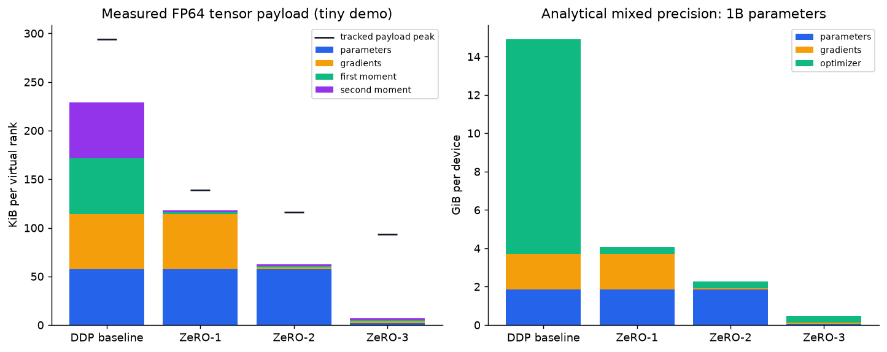
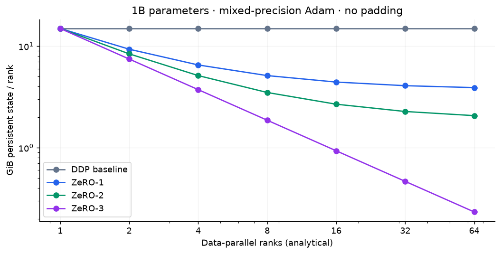
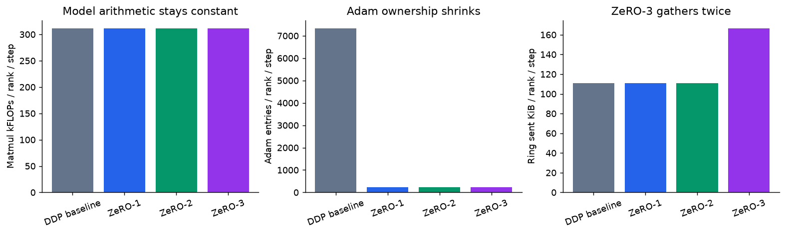
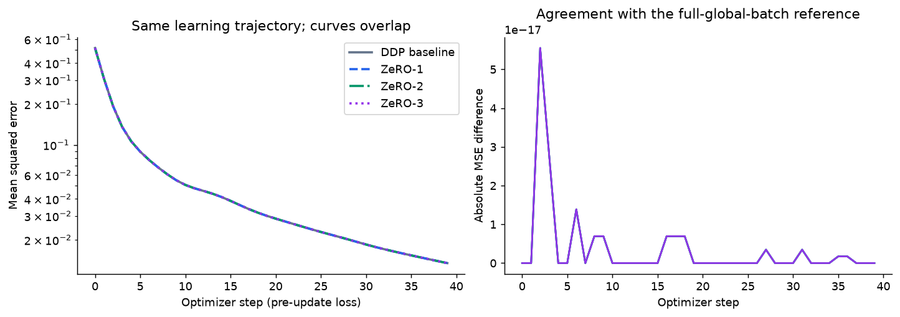

# Assignment 12 — ZeRO on 32 virtual GPUs

**32 virtual ranks train the same small neural network using DDP, ZeRO-1, ZeRO-2,
and ZeRO-3. The weights and loss agree; the storage ownership, optimizer work,
and communication schedule change.**

**Submission:** [executed notebook](zero_simulation.ipynb) ·
[GitHub repository](https://github.com/shankarpandala/era-v5) ·
[grader checklist](GRADERS.md).

[](https://colab.research.google.com/github/shankarpandala/era-v5/blob/codex/assignment-12-zero-simulation/assignment-12/zero_simulation.ipynb)

The notebook is standalone: open it in Colab, select a CPU runtime, and **Run all**.
It embeds the complete simulator and generates its own data. No model, dataset,
DeepSpeed, repository clone, or GPU download is required. A Colab GPU can remain
disabled because this assignment uses CPU threads as the virtual devices.

## What is submitted

| Requirement | Implementation and evidence |
|---|---|
| Work with agents | Separate agents inspected previous assignments, implemented the simulator, reviewed the ZeRO mathematics, and wrote numerical tests plus an independent artifact audit. |
| Create 32 virtual GPUs | 32 rank objects with separate NumPy buffers, scheduled through `ThreadPoolExecutor(max_workers=32)`. |
| Run a demo model | A real 32 → 64 → 64 → 16 MLP, manual backpropagation, MSE, and Adam; 40 optimizer steps over a deterministic synthetic regression dataset. |
| Simulate ZeRO-1/2/3 | Actual optimizer, gradient, and parameter shards; layer collectives reconstruct and average real arrays. DDP is the replicated baseline. |
| Show memory changes | Array `nbytes`, a scoped tracked payload peak, state ownership tables, memory plots, and a separate mixed-precision 1B-parameter projection. |
| Show computation changes | Forward/backward matmul FLOPs, Adam entries updated, first-step collective traces, modeled network bytes, and observed CPU wall time. |
| Notebook and detailed repository write-up | This README, the executed notebook, saved JSON and plots, reproduction commands, tests, and audit. |

## Run and verify

Python 3.10+ is supported. From the repository root:

```bash
cd assignment-12
python -m pip install -r requirements.txt
python run_demo.py --verify-only  # read-only audit of the supplied evidence
python -m pytest tests -q        # numerical correctness and ownership invariants
python run_demo.py               # execute every notebook cell, save outputs, audit
python run_demo.py --fast        # eight-step smoke run; overwrites saved outputs
```

Use a full run after `--fast` before submission. Timings depend on the machine;
losses, byte counts, and FLOP counts are reproducible within floating-point tolerance.
There are 32 logical ranks even on a host with fewer CPU cores. The operating system
time-slices the pool; the observed number of threads that execute work can be lower
than its maximum. This does not create CUDA devices or promise 32-way speedup.

`zero_simulator.py` is the editable implementation. `build_notebook.py` embeds its
exact source into an `export`-tagged cell, so the notebook also works in isolation:

```bash
python build_notebook.py         # rebuild after editing the simulator/narrative
python run_demo.py               # restore executed outputs and regenerate evidence
```

The audit rejects a stale embedded implementation. `--verify-only` does not rewrite
the notebook, artifacts, or run log.

## 1. The model and virtual cluster

The MLP has **7,312 useful parameters**. Each layer's flattened weight and bias
vector is padded to a multiple of 32: **7,328 allocated entries**, including 16
zeros. The largest padded layer has 4,160 entries. All modes use the same padding,
initialization, data, learning rate, and global batch.

Each rank receives eight distinct examples. The global batch is therefore
`32 × 8 = 256`; one step covers the complete fixed dataset. A seeded teacher
generates regression targets. The purpose is to prove a real training update and
its equivalence, not to claim generalization or state-of-the-art task accuracy.

The engine runs a layer across the 32 rank objects, waits for their contributions,
and performs the corresponding collective in the coordinator. Collectives operate
on the actual arrays; they are not just labels in a cost calculator. The coordinator
uses shared-memory NumPy operations rather than a physical network ring. Each
collective also records the payload a ring implementation would send.

Arithmetic uses **float64** to make small differences easy to detect. Parameters,
gradients, and Adam's two moments each occupy eight bytes per element. There is
**no separate master parameter copy** in this executable. The standard 16-byte
mixed-precision example is calculated separately below.

## 2. What each ZeRO stage does

| Mode | Parameters | Gradient capacity | Adam first/second moments |
|---|---|---|---|
| DDP / stage 0 | Full copy on every rank | Full copy | Full copies |
| ZeRO-1 | Full copy | Full copy | Each rank owns 1/32 |
| ZeRO-2 | Full copy | Each rank owns 1/32 | Each rank owns 1/32 |
| ZeRO-3 | Each rank owns 1/32 | Each rank owns 1/32 | Each rank owns 1/32 |

**DDP:** compute local gradients, all-reduce their average, and update a complete
Adam state and parameter copy on every rank.

**ZeRO-1:** retain full local gradient buffers, reduce-scatter their average to the
owners, and update only each owner's parameter and moment slices. All-gather the
updated parameter slices so every rank can run the next forward pass. Non-owned
gradient entries can remain local: the algorithm does not need a full reduced
gradient on every rank. Replicated gradient **allocation** distinguishes this
stage from stage 2.

**ZeRO-2:** reduce-scatter each layer's gradient as it becomes ready, retain only
the owned slice, and discard the temporary full-layer gradient. Update each shard
and all-gather the updated parameters. There is no persistent full-model gradient
buffer per rank.

**ZeRO-3:** keep parameter shards as well. Gather one layer for forward, release it,
then gather it again for backward. Reduce-scatter that layer's gradient, release
the gathered parameters, and eventually update the owned parameter/moment shards.
There is no post-update parameter all-gather. Full-model reconstruction is used
outside training for evaluation/parity, not as a persistent rank-owned replica.
The engine does not update parameters until backward is complete.

## 3. Memory: measure what is stored

Write `Q = 7,328` for allocated entries and `N = 32`. Persistent model state is
counted from the actual rank-owned arrays, including reserved gradient capacity.

| Mode | FP64 persistent bytes per rank |
|---|---|
| DDP | `32Q` |
| ZeRO-1 | `16Q + 16Q/N` |
| ZeRO-2 | `8Q + 24Q/N` |
| ZeRO-3 | `32Q/N` |

The full 40-step run records the following (KiB = 1,024 bytes):

| Mode | Persistent KiB/rank | Tracked peak KiB/rank | Ring sent KiB/rank/step | Final MSE |
|---|---:|---:|---:|---:|
| DDP | 229.000 | 294.000 | 110.922 | 0.0130472 |
| ZeRO-1 | 118.078 | 139.078 | 110.922 | 0.0130472 |
| ZeRO-2 | 62.617 | 116.117 | 110.922 | 0.0130472 |
| ZeRO-3 | 7.156 | 93.156 | 166.383 | 0.0130472 |

Initial MSE is **0.5166044**. All stages match DDP exactly in this run, and the
largest parameter difference from the single-global-batch reference is
**3.33 × 10⁻¹⁶**. ZeRO-3 reduces persistent state **32×**, but reduces the scoped
tracked peak only **3.16×** because gathered layers and temporary arrays remain.



**Persistent state is not total peak memory.** The tracked peak additionally samples
explicit activation caches, layer gathers, temporary layer gradients, and backward
buffers at instrumentation points. ZeRO-3 must temporarily materialize a complete
layer. Activation storage is not sharded by these ZeRO stages.

This counter excludes coordinator scratch, the dataset, reference/evaluation
models, Python objects, allocator reservations, BLAS workspace, and internal NumPy
expression temporaries. It is a tracked rank-local tensor payload, **not host RSS,
GPU allocated memory, or a proof that the whole process needs only that many bytes**.
All 32 ranks physically share one process and host memory in this simulation.

### The familiar mixed-precision 16-byte model

The separate projection assumes **2 bytes of parameters + 2 bytes of gradients +
12 bytes of optimizer state**. The last term is a 4-byte master weight and two
4-byte Adam moments. For `P` useful parameters, ignoring padding:

| Mode | Bytes per rank | 1B parameters, 32 ranks (GiB/rank) | Reduction vs DDP |
|---|---|---:|---:|
| DDP | `16P` | 14.901 | 1.00× |
| ZeRO-1 | `4P + 12P/N` | 4.075 | 3.66× |
| ZeRO-2 | `2P + 14P/N` | 2.270 | 6.56× |
| ZeRO-3 | `16P/N` | 0.466 | 32.00× |

One GiB is `2**30` bytes. These are **analytical persistent-state projections**;
the notebook does not train a billion-parameter model. Actual systems can use
different gradient/master-weight precision. Activations, temporary buffers,
fragmentation, and communication workspace must be added to size real hardware.



Increasing rank count leaves DDP unchanged. ZeRO-1 approaches a `4P` floor;
ZeRO-2 approaches `2P`; ZeRO-3's persistent state scales as `1/N`. Its gathered
layers and activations do not follow that last line. At one rank, all four
storage formulas coincide and modeled network traffic is zero.

## 4. Computation and communication

All stages perform the **same forward and backward model arithmetic per rank**
at the same local batch size. Every rank still executes every layer. ZeRO partitions
state storage; it does not turn this MLP into tensor parallelism.

For local batch `b`, layer dimensions `d_in,d_out`, and a multiply-add counted as
two FLOPs, forward matrix multiplication costs `2b × sum(d_in × d_out)`.
Backward computes a weight gradient for every layer plus input gradients for
all but the first layer. Bias sums, nonlinearities, loss arithmetic, collective
reductions, and optimizer operations are excluded from this matmul-only count.

Adam updates **7,328 entries per rank in DDP** and **229 per rank in each ZeRO
stage**. These counts include harmless zero padding. This is an element count,
not a claim that one Adam update is one FLOP. Across all ranks, redundant Adam
work falls from `NQ` updates to `Q`, while model matmul work stays constant.

Let `S = 8Q` bytes for the FP64 parameter/gradient vector and `q = (N−1)/N`.
For an ideal ring, a reduce-scatter or all-gather sends `qS` bytes per rank;
an all-reduce sends `2qS`.

| Mode | Per-step schedule | Ring bytes sent per rank |
|---|---|---|
| DDP | Gradient all-reduce | `2qS` |
| ZeRO-1 | Gradient reduce-scatter + updated parameter all-gather | `2qS` |
| ZeRO-2 | Gradient reduce-scatter + updated parameter all-gather | `2qS` |
| ZeRO-3 | Forward parameter all-gather + backward parameter all-gather + gradient reduce-scatter | `3qS` |

Thus the chosen ZeRO-3 schedule sends **1.5×** the bytes of DDP/ZeRO-1/ZeRO-2.
Received bytes match sent bytes; summing send and receive doubles the table.
The code records actual collective events, but their ring cost is **modeled**,
not a network measurement. Padding is included. Latency, topology, overlapping,
and transport headers are omitted. Gathering by layer increases collective call
count; keeping parameters resident could change the trade-off.



CPU milliseconds per step and phase totals are saved in `results.json` and displayed
in the notebook. They measure this Python/NumPy simulator, including coordinator
and thread-pool overhead. No timing here establishes that one ZeRO stage is faster
on GPUs. The arithmetic and communication ledger explain the algorithmic changes
without relying on that timing ordering.

## 5. Correctness evidence



All modes start with identical parameters, use the same local examples, average
gradients with the same global-batch normalization, and use identical Adam settings.
The experiment compares every stage against DDP **and** a single unsharded model
trained on the whole 256-example batch. The full-batch reference catches an
incorrect cross-rank averaging factor that stage-to-stage agreement alone would miss.
Float64 parameter differences must stay below `1e-10`.

The tests independently exercise gradient correctness, collective arithmetic,
shard ownership, padding, state byte counts, stage equivalence, and the one-rank
boundary. The artifact audit reads the saved evidence and recomputes the memory,
FLOP, and communication relationships; it also checks that every notebook code cell
ran without errors and that its embedded source matches the tested module.

Validation for the supplied full run: **29 tests pass**, and the independent
artifact audit reports **PASS**. Forward matmul work is **114,688 FLOPs/rank/step**
and backward is **196,608** in every stage.

The loss curve records the loss **before** each update; `final_loss` is reevaluated
after the final update. Timings are observations, not deterministic acceptance
thresholds. The saved JSON distinguishes real parameter counts from padding.

## Files

```text
assignment-12/
  zero_simulation.ipynb          standalone notebook, saved with outputs
  zero_simulator.py              rank buffers, MLP, Adam, collectives, counters
  build_notebook.py              embed the engine and assemble the narrative
  run_demo.py                    execute the notebook and audit its evidence
  audit.py                       independent checks of saved artifacts
  requirements.txt
  tests/                        numerical and ownership tests
  GRADERS.md
  submission_artifacts/
    results.json                curves, memory, FLOPs, timings, collective traces
    run_config.json             seeded reproduction settings
    run.log                     execution and audit result
    plots/                      four notebook figures
```

## Scope and sources

This is an educational simulation of the ownership and collective semantics of
ZeRO. It omits NCCL, real multi-node processes, distributed failure recovery,
communication overlap, activation checkpointing, offload, mixed-precision execution,
and optimized persistence/prefetch policies. A full-layer gather can be too large
for a real GPU even when persistent shards fit. A layer/bucket-size sweep and real
distributed benchmarking would be separate experiments.

The stage definitions follow [DeepSpeed's ZeRO documentation](https://deepspeed.readthedocs.io/en/latest/zero3.html).
The memory and ring-volume models follow the assumptions in the
[ZeRO paper, especially §§3, 5, and 7](https://arxiv.org/html/1910.02054v3).
The [official DeepSpeed tutorial](https://www.deepspeed.ai/tutorials/zero/) explains
how these stages are enabled in an actual training stack. All measurements in this
submission come from the included simulator, rather than those sources' benchmarks.
