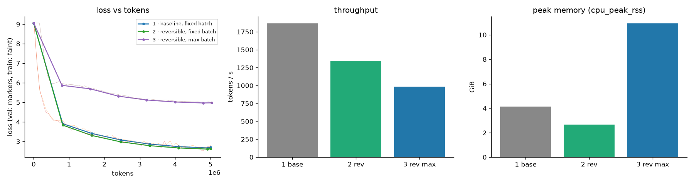
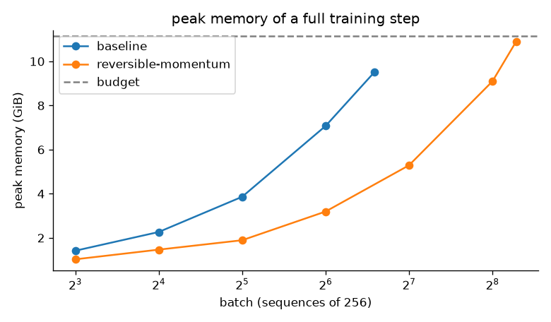
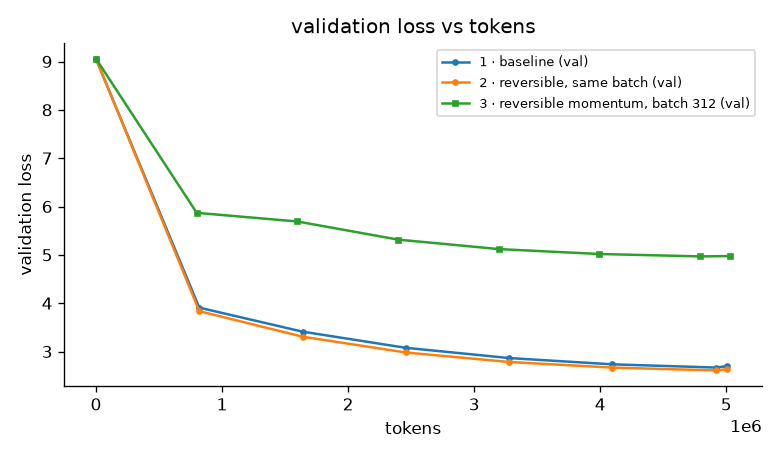

# Assignment 13 — Reversible LLM training: a 20M GPT three ways

**The same 20.99M-parameter GPT trained on TinyStories three times: as an ordinary residual
transformer at a batch that fits; rebuilt so that no layer activation is stored and trained at the
same batch; and, with the memory that frees, at the largest batch the machine can hold.**
Three reversible discretisations (RevNet/Reformer additive coupling, explicit midpoint, momentum
residual) share one custom backward that reconstructs activations instead of storing them, proven
against ordinary autograd to `1e-9`.

**Submission:** executed notebooks
[`01_baseline_fixed_batch.ipynb`](01_baseline_fixed_batch.ipynb) ·
[`02_reversible_fixed_batch.ipynb`](02_reversible_fixed_batch.ipynb) ·
[`03_reversible_max_batch.ipynb`](03_reversible_max_batch.ipynb) ·
[`04_report.ipynb`](04_report.ipynb) ·
[GitHub repository](https://github.com/shankarpandala/era-v5) · [grader card](GRADERS.md).

[](https://colab.research.google.com/github/shankarpandala/era-v5/blob/main/assignment-13/01_baseline_fixed_batch.ipynb)
— each notebook is standalone: the implementation is embedded, the data is fetched, nothing is
installed. Select a GPU runtime (a T4 is enough) and **Run all**; run them in order 01 → 04.

## What is submitted

| Requirement | Where it is |
|---|---|
| Train a 20M LLM for 50M tokens at a batch you can run | Notebook 01. `ModelConfig()` is 20,989,440 parameters; `A13_TOKENS` defaults to 50,000,000 and the fixed batch is 32 × 256 = 8,192 tokens/step. The committed execution is the CPU pilot described in §1. |
| Train again with reversibility, report which variant worked | Notebook 02: invertibility and gradient checks for `euler`, `midpoint` and `momentum`, an exact activation-vs-depth sweep, a four-arm screening (`euler`, `midpoint` 2h=1, `midpoint` 2h=2, `momentum`), then the winner trained at the baseline's batch and budget. §5. |
| Train again with reversibility at the maximum batch | Notebook 03: a max-batch search that runs real training steps for the baseline *and* the reversible model, then the reversible model trained at its maximum with a √-scaled learning rate. §6. |
| Report final loss, speed, peak memory and findings | §1 (headline table), §5–§7; every number is re-derived from `submission_artifacts/` by [`audit.py`](audit.py). |
| Detailed README, repo with the notebooks | This file; notebooks committed with outputs; `run_demo.py` regenerates everything. |

## Run and verify

```bash
cd assignment-13
python -m pip install -r requirements.txt
python run_demo.py --verify-only        # read-only audit of the committed evidence
python -m pytest tests -q               # 29 tests: reversibility, training pieces, artifacts + audit
python run_demo.py                      # re-execute the four notebooks at the committed pilot budget, then audit
python run_demo.py --tokens 50000000 --screen-tokens 5000000   # the assignment's full scale (GPU advised)
python run_demo.py --fast               # a few-step smoke run of every notebook
```

`revllm.py` is the editable implementation; `build_notebooks.py` embeds its exact source in an
`export`-tagged cell of every notebook, and the audit rejects a stale embedding. Budgets are
environment variables read by the notebooks' configuration cell (`A13_TOKENS`,
`A13_SCREEN_TOKENS`, `A13_BATCH`), so the same notebook is the pilot and the full-scale run.

## 1. Headline: the three runs

**Budget.** The committed outputs are a **CPU pilot of the full protocol at 5,005,312 training
tokens per arm** (611 steps of 32 × 256), with 1,007,616 tokens per screened variant — 10% of the
assignment's 50M. The reason is arithmetic, not choice: this session has four Xeon cores and no
GPU, and even after fixing a 2.3× denormal-float slowdown (§7) a 50M-token arm costs 7.4 h here
and the reversible arms 10 h each. The notebooks' defaults *are* 50M tokens and 5M per screened
variant; on a Colab T4 each arm is roughly an hour and the same files come out with the same
audit. Every number below is measured, nothing is extrapolated, and the two budgets are never
mixed.

| run | model | batch | tokens / steps | peak lr | train loss | **val loss** (ppl) | **tokens/s** | step | **peak memory** (RSS) | activations kept per step |
|---|---|---|---|---|---:|---:|---:|---:|---:|---:|
| 1 | baseline residual GPT | 32 × 256 | 5,005,312 / 611 | 1.0e-3 | 2.7878 | **2.6964** (14.8) | **1,869** | 4.37 s | **4.15 GiB** | 2,579 MiB |
| 2 | reversible `momentum`, same batch | 32 × 256 | 5,005,312 / 611 | 1.0e-3 | 2.7094 | **2.6332** (13.9) | **1,345** | 6.07 s | **2.67 GiB** | 560 MiB |
| 3 | reversible `momentum`, **max batch** | **312** × 256 | 5,031,936 / 63 | 3.0e-3 | 5.0508 | **4.9749** (144.7) | **986** | 80.97 s | **10.95 GiB** | 5,462 MiB |

Maximum batch found by real training steps within 75% of free RAM: baseline **96**, reversible
**312** (3.25×). Reversible variant that worked: **`momentum`** (γ = 0.9); `euler` and both
`midpoint` settings trained without diverging but slower (§5.1).



In one paragraph: **at the same batch, dropping stored activations cost 28% of throughput,
saved 36% of peak memory (78% of what autograd keeps), and cost nothing in loss** — the
reversible model finished 0.063 nats *ahead*. **The memory it freed bought a 3.25× larger
batch**, but spending a fixed 5M-token budget in 63 steps instead of 611 left the model 2.3 nats
behind: at this budget the model is far past its critical batch size, so the extra tokens per step
are wasted, and this is the honest reading of "push it to the maximum batch size". §5–§7 have
the evidence; §8 says what the CPU pilot cannot tell you.

## 2. The model and the data

| | |
|---|---|
| Parameters | **20,989,440** total: 17,745,408 in the ten blocks, 3,145,728 in the tied token embedding, 98,304 positions |
| Architecture | pre-LN GPT: d = 384, 10 layers, 6 heads, 4× MLP with tanh-GELU, context 256, tied output head, no dropout |
| Tokenizer | byte-level BPE, 8,192 tokens, trained on the first 20 MB of TinyStories V2 (`data/tokenizer.json`, sha256 in `data/manifest.json`); `<|endoftext|>` is id 0 and separates stories |
| Data | TinyStories V2 (GPT-4 generated) — the notebooks fetch only the prefix they need with an HTTP range request, drop the truncated last story, and write `uint16` token streams; 2,000,000 validation tokens from the official validation file |
| Batches | random 256-token windows (nanoGPT style), seeded; validation uses fixed, non-overlapping windows so every arm is scored on the same text |
| Optimiser | AdamW β = (0.9, 0.95), weight decay 0.1 on matrices only, gradient clip 1.0; linear warmup over 2.5% of the *token* budget, cosine to 10% of the peak — the schedule is a function of tokens seen, so it has the same shape at every batch size |
| Precision | fp32 on CPU (with denormals flushed to zero, see §7); bf16 autocast on Ampere+ GPUs, fp16 + `GradScaler` on a T4 |
| Seeds | one init seed (1234) and one data seed (0) shared by all arms |

## 3. Reversibility: three discretisations, one backward pass

A residual block `x' = x + f(x)` is a forward-Euler step, and inverting it needs a fixed-point
solve. Three schemes are invertible *algebraically*; all three keep exactly the baseline's
parameters (the embedding is copied into both streams and the streams are summed before the
final LayerNorm), so the comparison isolates the way activations are handled:

| Variant | Forward | Inverse | Where it comes from |
|---|---|---|---|
| `euler` | `y1' = y1 + Attn(LN y2)`, `y2' = y2 + MLP(LN y1')` | `y2 = y2' − MLP(LN y1')`, `y1 = y1' − Attn(LN y2)` | RevNet (Gomez et al. 2017) / Reformer (Kitaev et al. 2020) additive coupling; the symplectic-Euler step of a two-stream system |
| `midpoint` | `x[n+1] = x[n−1] + 2h·Δₙ(x[n])`, Δ = whole-block residual, 2h = 1 | `x[n−1] = x[n+1] − 2h·Δₙ(x[n])` | explicit midpoint / leapfrog rule (Chang et al. 2018) — one stream, two consecutive states |
| `momentum` | `v' = γv + (1−γ)Δ(x)`, `x' = x + v'`, γ = 0.9 | `x = x' − v'`, `v = (v' − (1−γ)Δ(x)) / γ` | Momentum ResNet (Sander et al. 2021) |

Every variant is a chain of *half-steps* `p' = α·p + β·f(q)` followed by the swap
`(p, q) ← (q, p')`. One `torch.autograd.Function` (`_ReversibleStack` in
[`revllm.py`](revllm.py)) runs the chain under `no_grad` and saves only the final pair. Its
backward walks the chain in reverse: recompute `f(q)` with autograd enabled, recover
`p = (p' − β·f(q)) / α`, and push the two state gradients back
(`dp ← α·dq`, `dq ← dp + β·∂f/∂qᵀ dq`). Parameter gradients are returned to autograd rather
than written into `.grad` as a side effect, so clipping, weight decay and `zero_grad` behave
normally. At any moment the backward holds four `B×T×d` tensors and one sublayer's graph:
memory is independent of depth.

**Proof that it is the same gradient.** `tests/test_reversible.py` runs each variant twice on the
same batch in float64 — once through the reversible backward, once with the identical recurrence
under plain autograd with activations stored — and requires every parameter gradient to agree to
`rtol 1e-9`; the notebook repeats the check at full size in fp32 and reports the inverse's
reconstruction error (`submission_artifacts/reversibility_checks.json`). Hand-written loops in the
tests pin down each recurrence so the `HalfStep` plan cannot silently drift from the equations above.

**Measuring what autograd keeps.** `SavedTensorMeter` registers
`torch.autograd.graph.saved_tensors_hooks` and counts the bytes of every tensor a backward node
keeps alive, separating tensors that alias a parameter from activations. It is exact and identical
on every device, which is why the README quotes it next to the device-specific peak memory.

## 4. How the three measurements are taken

* **Loss.** Cross-entropy in nats on the same 512 fixed validation windows (131,072 tokens) for
  every arm, evaluated after the last update; the train loss is the mean of the last 20 logged steps.
* **Speed.** Tokens per second = training tokens / wall-clock seconds spent inside optimiser steps
  (forward, backward, clip, update; the device is synchronised around each step). Evaluation,
  logging, checkpointing and data loading are excluded, so the number is the model's throughput,
  not the notebook's.
* **Peak memory.** On CUDA, `torch.cuda.max_memory_allocated()` over the whole training phase
  (reserved memory is recorded too). On CPU there is no allocator counter, so a sampling thread
  records the peak resident set size (RSS) of the process every 20 ms — an upper bound that
  includes Python, the data memmap and the allocator's cache. Large tensors are `mmap`-backed and
  return to the OS on free, so the RSS peak tracks the working set of a step; the exact
  autograd-saved byte count above is the device-independent complement.
* **Maximum batch.** `find_max_batch` builds a fresh model and optimiser and runs two complete
  training steps per trial. On CUDA it doubles the batch until a step raises
  `OutOfMemoryError`, then bisects. A CPU process is killed by the OS instead of raising, so on
  CPU each doubling is gated by a linear fit of peak RSS to batch (the steeper of the local and
  average slopes, i.e. the conservative one) against 85% of the free RAM, and the answer is
  verified by real steps before it is used.

## 5. Runs 1 and 2 at the fixed batch

### 5.1 Which reversible variant worked

All three discretisations are exactly invertible at full size (reconstruction error ≤ 1e-6 in
fp32) and their reversible backward reproduces stored-activation autograd to a relative 1e-6
(`reversibility_checks.json`). So the screening is about *optimisation*, not correctness. Each arm
got 1,000,000 tokens at batch 32, the same seed, schedule and peak learning rate:

| configuration | val loss @ 0.4M / 0.8M / 1.0M tokens | train loss (last 20) | max clipped grad norm | tokens/s | peak RSS | diverged |
|---|---|---:|---:|---:|---:|---|
| `momentum`, γ = 0.9 | 4.633 / 4.084 / **4.0574** | 4.936 | 5.4 | 1,280 | 2.48 GiB | False |
| `euler` (RevNet coupling) | 5.078 / 4.617 / **4.5440** | 5.312 | 13.3 | 1,279 | 2.53 GiB | False |
| `midpoint`, 2h = 1 | 5.149 / 4.813 / **4.7524** | 5.436 | 12.2 | 1,311 | 2.60 GiB | False |
| `midpoint`, 2h = 2 (textbook) | 5.299 / 4.951 / **4.8941** | 5.582 | 14.0 | 1,330 | 2.69 GiB | False |

**`momentum` won, clearly, and the ranking is not noise.** The differences at the last eval are
five to twenty times the eval-to-eval jitter, and the order is the same at every evaluation
(400K and 800K tokens too). The reading:

* **`momentum` keeps the baseline's information flow.** Its position stream `x` sees every
  earlier block's increment (through the accumulated velocity), just as a residual stream does;
  only the *amount* each block adds is smoothed by `γ = 0.9`. Its early curve is the closest to
  the baseline's, and its gradients were the tamest of the four (max clipped norm 5.4 versus
  12–14 for the others).
* **`euler` splits the residual stream in two.** Attention only ever reads the MLP stream and
  the MLP only reads the attention stream, so no sublayer sees the sum both accumulate — a
  restriction Reformer and RevViT report as harmless at scale, but which costs a 10-layer model
  visibly in its first million tokens.
* **`midpoint` couples whole blocks across two parity chains** (`x[n+1]` is built from
  `x[n−1]` and the block applied to `x[n]`), so each block reads a state that skips the block
  before it. With residual-sized steps (2h = 1) it trails `euler`; the textbook 2h = 2 is worse
  still, as expected from the leapfrog's parasitic mode (the two chains can drift apart and every
  increment is doubled). Neither diverged at this learning rate, so "worked" here means
  "trained, but slower" rather than "failed".

Runs 2 and 3 therefore use `momentum` (γ = 0.9).

### 5.2 Run 2 versus run 1: same batch, same budget, no stored activations

| | run 1 · baseline | run 2 · reversible `momentum` | ratio |
|---|---:|---:|---:|
| Steps × tokens/step | 611 × 8,192 | 611 × 8,192 | — |
| Final validation loss (512 windows) | 2.6964 (ppl 14.83) | **2.6332** (ppl 13.92) | −0.063 nats |
| Train loss, last 20 logged steps | 2.7878 | 2.7094 | |
| Validation loss at 0.8M / 2.5M / 4.9M tokens | 3.908 / 3.077 / 2.669 | 3.835 / 2.980 / 2.610 | ahead at every eval |
| Tokens per second | **1,869** | 1,345 | 0.72× |
| Step time | 4.37 ± 0.23 s | 6.07 ± 0.19 s | 1.39× |
| Peak RSS during training | **4.15 GiB** | **2.67 GiB** | 0.64× |
| Activations autograd keeps per step | 2,579 MiB (253 tensors) | 560 MiB (15 tensors) | 0.22× |
| Max clipped gradient norm | 11.6 | 5.4 | |
| Inverse reconstruction error (max abs) | — | 3.2e-7 | |

Three things to take from this table.

**The memory claim is exact and the peak follows it.** With ten reversible blocks autograd
holds 15 tensors instead of 253, and the 560 MiB that remain are *not the layers*: measured
tensor by tensor, they are two vocabulary-sized 8,192 × 8,192 fp32 tensors kept by the
cross-entropy (512 MiB), the final state pair and the last LayerNorm's input (4 × 12 MiB) and a
few index vectors. Reversibility
removed the depth term entirely; what is left is the head, which assignment 9's chunked
cross-entropy would remove next. Peak RSS fell by 1.48 GiB, which is the 2.0 GiB of activations
minus the reversible backward's own working set (four `B×T×d` tensors plus one sublayer's graph).

**The speed cost is the recompute, and it is what the literature says.** Each half-step's `f`
is evaluated twice — once forward, once during backward — so the backward pays roughly one extra
forward: measured 1.39× the baseline's step time (RevViT reports ≈1.3×). The reversible arm is
28% slower per token at this batch. (A cold-process micro-benchmark before the runs showed the
opposite, the baseline being slowed by first-touch page faults on its 2.6 GB of activations; the
runs, where the allocator reuses pages, are the honest measurement.)

**Loss did not suffer — the momentum variant finished 0.063 nats ahead** and was ahead at every
evaluation. This is one seed at a pilot budget, so it should be read as "no penalty" rather than
"reversible is better"; a plausible mechanism is the smoothing γ applies to each block's
increment, which also kept the gradient norm at less than half the baseline's. Both models write
coherent TinyStories at temperature 0 (samples in the notebooks and `results.json`).

## 6. Run 3: the batch reversibility buys, and what it costs at a fixed budget

### 6.1 The search

Every trial is a fresh model and optimiser running two complete training steps (forward,
reversible or ordinary backward, clip, AdamW update), so optimiser state and the backward's
working set are in the number. The budget is 75% of the RAM that was free when the search
started (≈ 11.1 GiB of 14.6 GiB), because a CPU process is killed rather than told when it
overcommits.

| batch (× 256 tokens) | 8 | 16 | 32 | 64 | 96 | 128 | 256 | 312 |
|---|---:|---:|---:|---:|---:|---:|---:|---:|
| baseline, peak RSS (GiB) | 1.42 | 2.27 | 3.86 | 7.07 | **9.51** | *predicted 12.6, over budget* | | |
| reversible `momentum`, peak RSS (GiB) | 1.03 | 1.47 | 1.89 | 3.19 | | 5.29 | 9.09 | **10.90** |
| baseline, tok/s in the trial | 1,688 | 1,931 | 1,349 | 1,273 | 1,121 | | | |
| reversible, tok/s in the trial | 1,240 | 1,375 | 1,422 | 1,438 | | 1,161 | 928 | 902 |

* **Maximum batch: baseline 96, reversible 312 — 3.25× more sequences (79,872 tokens per
  step instead of 24,576).** The slopes tell the same story as the exact byte counts:
  the baseline's peak grows 75–100 MB per sequence (its ten blocks' activations), the reversible
  model's 30–32 MB per sequence — and that residue is the vocabulary head plus the backward's
  working set, not the depth. Chunked cross-entropy would tilt the reversible line further.
* **On this CPU a bigger batch does not buy throughput.** The reversible model's tokens/s peaks
  around batch 64 (1,438) and falls to 902 at 312; the baseline peaks at 16. The 33 MiB L3
  cache is the reason — once a step's working set no longer fits, every matmul streams from
  DRAM. On a GPU the usual expectation is the opposite (larger batches raise utilisation until
  the kernels saturate); the notebook measures whichever device it runs on.



### 6.2 Run 3: training at batch 312

| | run 2 · batch 32 | run 3 · batch 312 |
|---|---:|---:|
| Tokens per step | 8,192 | 79,872 |
| Steps for ≈5M tokens | 611 | 63 |
| Peak learning rate | 1e-3 | 3e-3 (√(312/32) · 1e-3 = 3.1e-3, capped) |
| Final validation loss | **2.6332** | **4.9749** |
| Validation loss at 0.8M / 2.4M / 4.8M tokens | 3.835 / 2.980 / 2.610 | 5.869 / 5.316 / 4.968 |
| Tokens per second | 1,345 | 986 |
| Step time | 6.07 s | 80.97 s |
| Peak RSS | 2.67 GiB | 10.95 GiB |
| Activations autograd keeps per step | 560 MiB | 5,462 MiB (the same 70 KiB per token) |
| Max clipped gradient norm | 5.4 | 5.2 |

The large-batch run is stable (no divergence, gradient norms as tame as run 2's, the train
loss falls monotonically from 9.06 to 4.99) — it is simply **63 optimiser steps into training**.
Compare it per *step* rather than per token: the momentum screening arm, at the same batch 32 as
run 2, read 4.633 after 50 steps and 4.084 after 100; run 3 reads 4.975 after 63 steps despite
three times the learning rate and 9.75× the tokens in every step. Per step the large batch is
no better, so almost all of its extra tokens were wasted: **this 20M model, in its first few
thousand steps, has a critical batch size well below 80K tokens.** The greedy sample makes the
same point in prose — run 3 has learned the first token of every story and not yet what follows it
(`Once upon a time. Once. Once. …`), while run 2 at the same tokens writes coherent stories.

None of this is an argument against run 3 as an experiment. It is what the assignment asked
for, and it answers a real question: reversibility bought a batch the baseline cannot hold, at a
memory-per-token that is 22% of the baseline's. Whether that batch is *worth* using depends on
the budget — at 50M tokens run 3 would take 630 steps and the gap would shrink; with gradient
accumulation the same memory could instead hold longer contexts. The pilot cannot say where the
crossover is; §8 lists it as the first thing the full-scale run should settle.



## 7. Findings, in order of how much they surprised me

1. **Three integrators, one backward, all exact.** Expressing `euler`, `midpoint` and
   `momentum` as chains of half-steps `p' = αp + βf(q)` made one 60-line `autograd.Function`
   serve all three. Reconstruction error at full size is 3–8 × 10⁻⁷ in fp32; parameter gradients
   agree with stored-activation autograd to ≤ 1.1 × 10⁻⁶ relative in fp32 and 10⁻⁹ in fp64 (tests).
   The momentum inverse divides by γ each layer, so its error grows like γ⁻ᴸ = 2.9× over ten
   layers; still 3 × 10⁻⁷.
2. **Activation memory is flat in depth, and the flat line is the vocabulary.** Autograd keeps
   70.0 MiB at batch 4 for 2, 4, 6, 8, 10 and 12 reversible layers, versus 118 → 373 MiB for the
   baseline (+25.5 MiB per layer). At batch 32 the reversible model keeps 560 MiB, of which
   512 MiB are the two 8,192 × 8,192 cross-entropy tensors. Reversibility solves the depth term;
   the head is the next wall, and assignment 9's chunked / online-softmax cross-entropy is the
   tool for it.
3. **The integrator you pick changes how fast the model learns, not whether it can.** At 1M
   tokens: `momentum` 4.057 < `euler` 4.544 < `midpoint` 4.752 < `midpoint` (2h = 2) 4.894, no
   divergences, identical parameters and schedules. The winner is the one whose position stream
   still sees every block's contribution; the two that split or skip the residual stream pay for
   it early. The textbook midpoint's doubled step is the worst, as its parasitic mode predicts.
4. **Reversible ≈ 1.39× the step time, and it did not cost loss.** 4.37 → 6.07 s per step at
   batch 32 (28% fewer tokens/s), the price of recomputing every `f` once in backward. The final
   validation loss was 0.063 nats *better* than the baseline's and ahead at every evaluation; one
   seed, so "no penalty" is the claim, not "better".
5. **3.25× the batch, 2.3 nats worse at a fixed budget.** Batch 312 versus 96 for the baseline;
   but 63 steps are 63 steps. Per step the large batch matched the small one at best, so the
   model is far past its critical batch size at this budget.
6. **On a 4-core CPU the largest batch is the slowest.** Reversible throughput peaks at batch 64
   (1,438 tok/s in the search) and falls to 902–986 at 312; the baseline peaks at 16. Once the
   working set leaves the 33 MiB L3, every matmul streams from DRAM. The same search on a GPU is
   expected to show the opposite slope, which is why the notebook measures rather than assumes.
7. **Denormal floats were the first "reversibility result".** The first profile showed the
   backward's `aten::mm` running at 74 GFLOP/s against a 300 GFLOP/s GEMM peak: tiny gradients
   were producing subnormal products, and Intel cores handle those in microcode.
   `torch.set_flush_denormal(True)` made every arm 2.3× faster; it is applied identically to all
   arms by `configure_runtime`. A cold-process benchmark then showed the reversible arm *faster*
   than the baseline — first-touch page faults on the baseline's 2.6 GB of activations — which the
   long runs, where the allocator reuses pages, reversed. Speed numbers in this README are from the
   runs, never from micro-benchmarks.

## 8. Limitations — read before quoting a number

* **The committed numbers are a CPU pilot, not the 50M-token Colab run.** The protocol, code and
  notebooks are the full assignment; the budget in the committed outputs is what four CPU cores
  could execute in one session. `python run_demo.py --tokens 50000000 --screen-tokens 5000000` (or
  *Run all* on Colab, whose defaults are exactly that) produces the full-scale evidence in the same
  files, and the README's tables are regenerated from `submission_artifacts/summary.md`.
* **Peak memory on CPU is RSS,** an upper bound that includes the Python process, the memmapped
  data and freed-but-cached pages. It is comparable across the three arms (same process layout)
  but not to a CUDA allocator counter. The exact autograd-saved bytes are the portable number.
* **Speed on CPU is not speed on a GPU.** The 1.39× step-time cost of recomputation matched
  what RevViT reports for GPUs, but the *batch-size* slope is CPU-specific: here the largest batch
  was the slowest (cache), whereas on a GPU larger batches usually raise utilisation until the
  kernels saturate. The notebook measures whichever device it runs on; do not carry the run-3
  tokens/s to a GPU.
* **Run 3's loss is a fixed-budget statement, not a verdict on large batches.** 63 steps with
  a heuristically scaled (and capped) learning rate cannot match 611; the first thing the
  full-scale run should settle is where, between 32 and 312, the crossover in loss-per-token sits
  at 50M tokens, and whether a tuned learning rate moves it. The pilot establishes the batch the
  reversible model *can* run and what it costs at 5M tokens; nothing more.
* **Screening at a short budget ranks early training.** The winner is the configuration with the
  lowest validation loss after 1M tokens with none diverging; the gaps are large and the order held
  at every evaluation, but a 50M-token budget could narrow them (Reformer reports parity for
  `euler`-style coupling at scale). One seed per arm.
* **No dropout, no activation checkpointing, no torch.compile,** in any arm: checkpointing would
  be the natural competitor (same recompute, O(√L) or O(L) stored block inputs instead of O(1)) and
  compile would change all arms' speed; neither was in scope.

## 9. Files

```text
assignment-13/
  01_baseline_fixed_batch.ipynb     run 1 — executed, outputs saved
  02_reversible_fixed_batch.ipynb   invertibility + gradient checks, depth sweep, variant screening, run 2
  03_reversible_max_batch.ipynb     max-batch search (baseline and reversible), run 3
  04_report.ipynb                   side-by-side tables and figures; writes summary.json / summary.md
  revllm.py                         the implementation embedded verbatim in every notebook
  build_notebooks.py                rebuilds the notebooks from revllm.py + narrative
  run_demo.py                       executes the notebooks in order, then audits
  audit.py                          read-only audit of every committed claim
  tests/                            29 tests: reversibility, training pieces, artifacts + audit
  data/tokenizer.json, manifest.json the committed tokenizer and the data manifest (streams are regenerated)
  submission_artifacts/
    run1_baseline/results.json, run2_reversible/results.json, run3_reversible_maxbatch/results.json
    screen_{euler,midpoint,momentum}/results.json, screening.json
    max_batch.json, depth_sweep.json, reversibility_checks.json, summary.json, summary.md, run.log
    plots/*.png
```

## 10. References

* Gomez, Ren, Urtasun, Grosse. *The Reversible Residual Network: Backpropagation Without Storing Activations.* NeurIPS 2017.
* Kitaev, Kaiser, Levskaya. *Reformer: The Efficient Transformer.* ICLR 2020 (reversible transformer layers).
* Chang, Meng, Haber, Ruthotto, Begert, Holtham. *Reversible Architectures for Arbitrarily Deep Residual Neural Networks.* AAAI 2018 (Hamiltonian / midpoint / leapfrog networks).
* Sander, Ablin, Blondel, Peyré. *Momentum Residual Neural Networks.* ICML 2021.
* Mangalam et al. *Reversible Vision Transformers.* CVPR 2022 (memory/throughput trade-off of reversible backprop).
* Eldan, Li. *TinyStories: How Small Can Language Models Be and Still Speak Coherent English?* 2023.
* Chen, Xu, Zhang, Guestrin. *Training Deep Nets with Sublinear Memory Cost.* 2016 (activation checkpointing, the comparison point).
