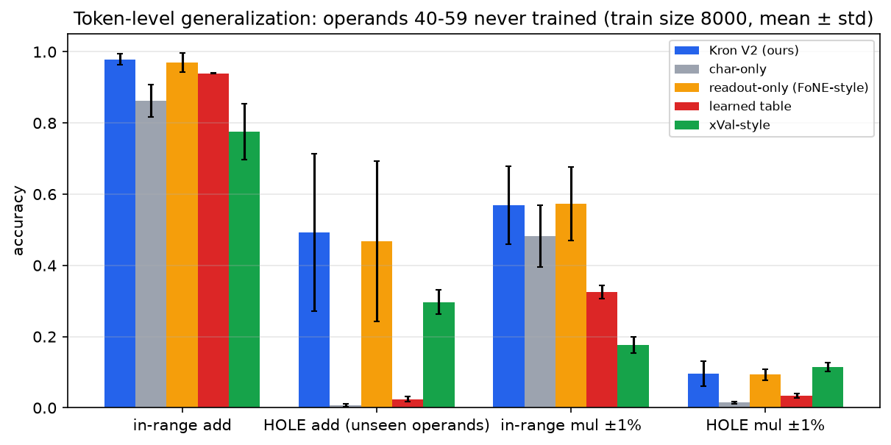
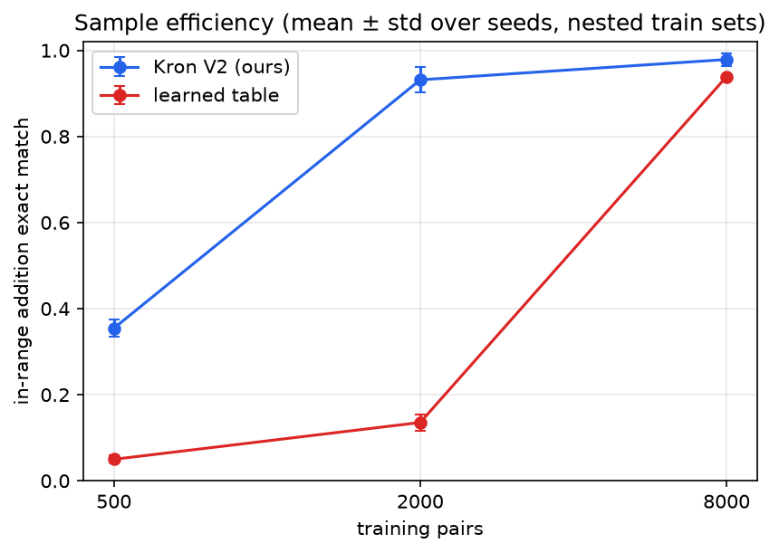
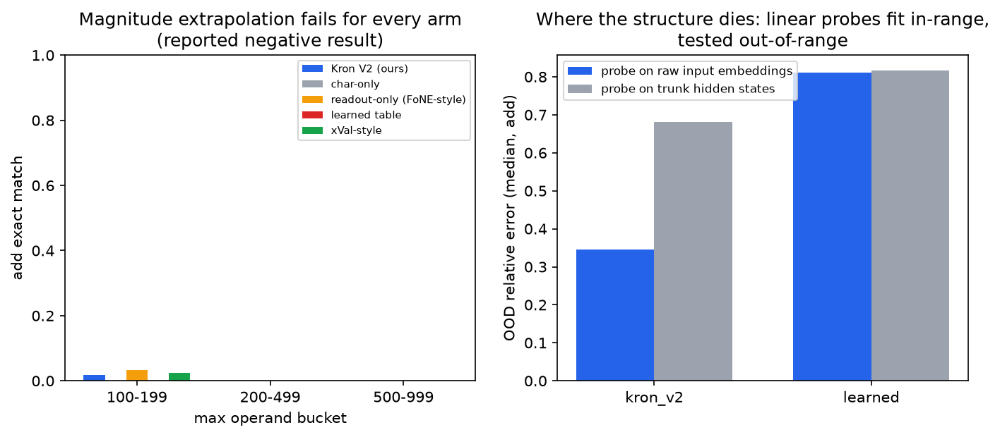
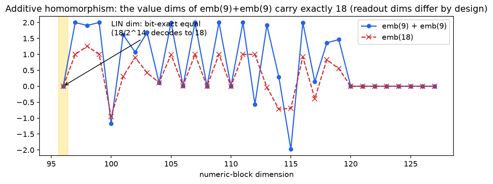
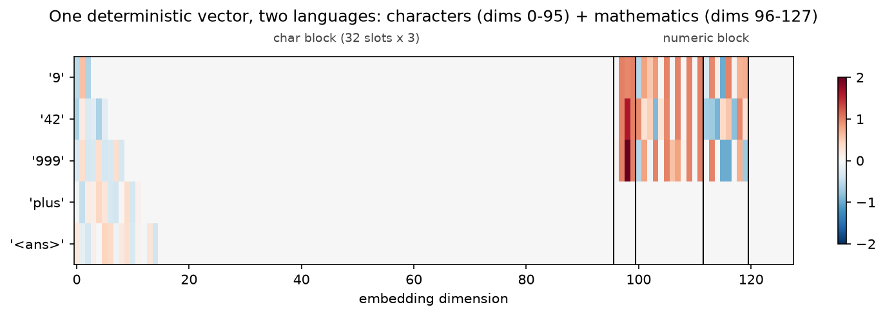
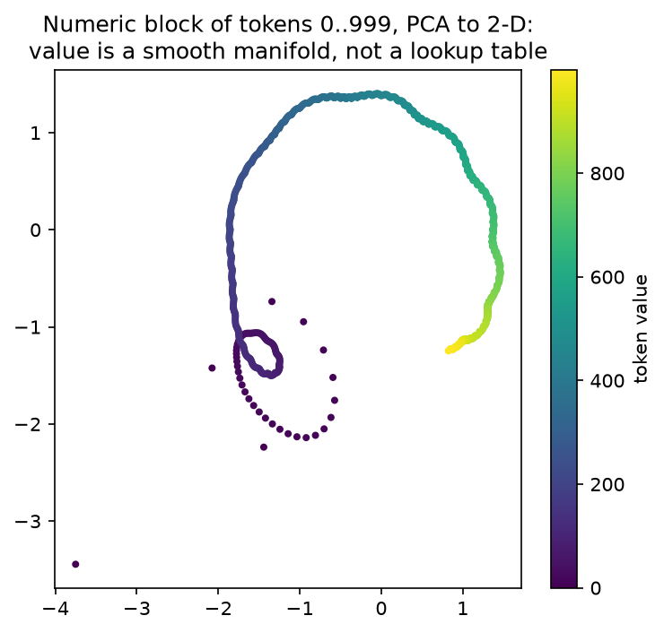

# Kronecker Embedding V2 — Embeddings That Carry Mathematical Structure

**Problem chosen: #1** — *"What if embeddings can store mathematical structure as
well? Say 9 … such that when we actually do 9 + 9, the mathematical meaning part
of the embeddings is itself 18! When we do 9×9 it becomes 81!"*

This assignment answers that question with a construction, a proof, and a
controlled experiment:

> **A single deterministic, non-learned token embedding can carry both
> orthographic identity (the 32-slot Kronecker character block) and genuine
> mathematical structure (an appended numeric block), such that**
> **(A)** vector arithmetic on the embedding *is* arithmetic — the value dim of
> `emb("9") + emb("9")` equals the value dim of `emb("18")` **bit-exactly in
> float32**, and a log dim turns multiplication into addition — and
> **(B)** a 2-layer transformer trained on a laptop CPU with this embedding
> beats learned embeddings on arithmetic in-range, with less data, and —
> the headline — **on number tokens it has never seen in training**.

Everything is reproducible with one command and re-verified by an independent
audit that trusts only the files on disk.

```bash
cd assignment-7
pip install -r requirements.txt
python run_demo.py          # full matrix, ~15-20 min on a laptop CPU
python run_demo.py --fast   # reduced matrix, ~3 min, same pipeline
python -m pytest tests/ -q  # 46 invariant tests
```

Open [`submission_artifacts/report.html`](submission_artifacts/report.html)
for the self-contained visual report (all figures inlined).

---

## 1. The idea

Kronecker V1 gives every word a deterministic embedding built from its
characters: slot *s* holds the code of character *s*. That solves orthographic
identity, but `"9"` is still just the *word* nine — the embedding knows how the
token is **spelled**, not what it **means**.

V2 keeps the character block untouched and **appends a numeric block** that
encodes the token's *value* in coordinates chosen so that vector arithmetic
mirrors mathematics:

```
dim   0-95   char block     32 slots × 3 dims   — spelling, invertible
dim   96     LIN = v / 2^14                     — vector + IS integer +   (exact)
dim   97     SIGN                               — sign, additive
dim   98     LOG = log10(v)  (v ≥ 1)            — vector + IS integer ×   (≈1e-7)
dim   99     NUMFLAG                            — 1 iff numeric (v=0 ≠ "no number")
dim 100-111  sin/cos 2πv/T, T = 10^1..10^6      — digit readout (NOT homomorphic)
dim 112-119  sin/cos over log10(v)              — magnitude readout for ×
dim 120-127  reserved (zeros)
```

The taxonomy is explicit and honest:

| dims | status | what it gives you |
|---|---|---|
| `LIN`, `SIGN` | **additively homomorphic** | `emb(a)+emb(b)` carries `a+b`, bit-exact |
| `LOG` | **multiplicatively homomorphic** (via +) | `logdim(a)+logdim(b) = logdim(a·b)` to ~1e-7 |
| Fourier dims, `NUMFLAG` | readout only | lets a tiny transformer read exact digits through LayerNorm |
| char block | orthographic | invertible spelling; **numbers are not a special token class** |

The last row is the differentiator against all prior work: `"9"` is
*simultaneously* the word made of the character `'9'` (char block) and the value
nine (numeric block). `"plus"` and `"<ans>"` live in the same space with an
empty numeric block. One embedding function serves the whole vocabulary.

### Why the exactness claim is real, not `allclose`

Any integer `|v| < 2^24` is exactly representable in float32 (24-bit mantissa).
Dividing by `2^14` — a power of two — changes only the exponent bits, so
`v/2^14` is exact. Adding two such dyadic rationals whose sum stays below
`2^20` is again exact. Therefore

```
emb("9")[LIN] + emb("9")[LIN] == emb("18")[LIN]     # float32 ==, not isclose
decode_value(emb("9") + emb("9")) == 18             # analytic inverse
```

`properties.py` verifies this over 10,000 random pairs up to 2^20 with
bit-exact equality (plus 7 more properties: log-multiplicativity, char and
value invertibility, zero-block hygiene, codebook margin, digit-phase
separation). This is **Claim A: the embedding is an algebra, before any
training happens.**

### The character codebook has no seed luck

Character codes are points of a **Fibonacci sphere lattice** — a deterministic
near-optimal packing of 44 unit vectors in 3-D. The worst pairwise angle is a
fixed constant (26.9°, max cosine 0.892, asserted in tests), so per-slot
nearest-neighbour decoding is exact **by construction**, not "random vectors
are probably fine".

### The output side mirrors the input side

The model does not classify over an answer vocabulary. Its regression head
predicts **the numeric block of the answer's own embedding** — the same
`numeric_features()` function generates input embeddings and training targets —
and an analytic decoder reconstructs the integer **digit-by-digit from the
predicted Fourier phases** (each digit only needs its phase within 1/20 of a
circle; the impossible alternative is one scalar accurate to 1e-6). The model
speaks the same numeric language in both directions, and no softmax over
answers exists. A conventional classification head is also trained and
reported — its structural ceiling (it cannot express any answer > 999) is part
of the findings.

---

## 2. The experiment

**Task.** Single-token arithmetic, the xVal/FoNE setting: sequences
`<bos> a op b = <ans> <eos>` with `op ∈ {+, *, plus, times}` (25% word-form —
the same model handles words and numbers through one embedding). Answers are
read at `<ans>`; the answer never appears as an input token.

**Data regimes** (all deterministic, hashed, disjoint by construction):

| split | operands | what it measures |
|---|---|---|
| train | 0–99, minus the hole | learning |
| eval-in | 0–99 held-out pairs, minus the hole | in-range generalization |
| **eval-hole** | **at least one operand in 40–59 — tokens NEVER seen at any input position in training** | **token-level generalization: are unseen-token embeddings meaningful?** |
| eval-extra | at least one operand in 100–999 | magnitude extrapolation (stress test) |

Train sets are **nested** (500 ⊂ 2000 ⊂ 8000) with a fixed eval, so the
sample-efficiency curve measures data volume and nothing else.

**One disclosure, stated precisely**: the hole is an *input-token* hole.
Hole-band **values** do occur as training *answers* (e.g. `30 + 12 = 42`
supervises the output heads with the value 42) — equally for every arm, and
with untied heads no gradient path reaches any arm's input embedding of a
hole token. What no arm ever observes is a hole token at an input position,
which is exactly what a claim about *input embeddings* requires. The manifest
records the count (`train_answers_in_hole_band`).

**Five arms, one architecture.** Every arm trains the identical 2-layer,
d_model-128, 4-head transformer (untied heads, ~548k trainable parameters in
the trunk+heads; the `learned`/`xval` arms additionally train a 129k-parameter
embedding table, i.e. ~24% *more* trainable capacity than the frozen arms)
with the identical optimizer, schedule, byte-identical batch stream (the
shuffle key deliberately excludes the arm name), and losses. The *only*
difference is the embedding provider — enforced by hashing the non-embedding
parameter shapes of every run and asserting all 27 hashes are equal (an audit
check, not a promise):

| arm | embedding | trainable? |
|---|---|---|
| `kron_v2` | char block + full numeric block (**ours**) | frozen |
| `kron_char` | char block only — ablation: no numeric block | frozen |
| `readout_only` | numeric block minus {LIN, SIGN, LOG} — FoNE-style ablation | frozen |
| `learned` | `nn.Embedding` lookup table — the conventional baseline | learned |
| `xval` | value-scaled shared direction (xVal-style) | learned |

`kron_v2 − readout_only` isolates exactly the homomorphic dims.
`kron_v2 − kron_char` isolates the whole numeric block.
The xval arm normalizes values by the largest *training-range* operand (99),
matching xVal's normalize-to-training-distribution convention — normalizing
by the largest vocab token (999) compresses all training inputs into
[0, 0.1] and costs the baseline ~0.2 in-range exact-match (we checked).

---

## 3. Results

All numbers are mean ± std over 3 seeds, produced by `python run_demo.py`
(27 runs, ~16 min total on a laptop CPU) and re-derived from disk by the
audit. Primary decode = digit-phase reconstruction; `±1%` = within 1% relative
error.

### 3.1 The headline: number tokens never seen in training

Operands 40–59 appear at **zero input positions** in training. For a learned
table those rows are untrained noise; for a deterministic scheme they are
analytically correct. Train size 8000:

| arm | in-range add exact | **HOLE add exact** | in-range mul ±1% | HOLE mul ±1% |
|---|---|---|---|---|
| **kron_v2 (ours)** | **0.979 ± 0.015** | **0.493 ± 0.220** | 0.569 ± 0.110 | 0.095 ± 0.035 |
| readout_only (FoNE-style) | 0.970 ± 0.026 | 0.467 ± 0.225 | 0.573 ± 0.104 | 0.093 ± 0.016 |
| xval-style | 0.775 ± 0.079 | 0.297 ± 0.034 | 0.177 ± 0.023 | 0.114 ± 0.013 |
| learned table | 0.939 ± 0.001 | 0.024 ± 0.008 | 0.325 ± 0.019 | 0.034 ± 0.006 |
| char-only | 0.863 ± 0.045 | 0.007 ± 0.005 | 0.482 ± 0.087 | 0.014 ± 0.004 |

At the 2000-pair operating point the hole result is both larger and far more
stable: **kron_v2 0.707 ± 0.063 vs learned 0.009 ± 0.008 — an 80× gap**
(at 8000 the gap is 21×; the audit's pass threshold, pre-specified in
`audit.py`, was 2×).



Four findings fall out of this table:

1. **The generalization ladder tracks the amount of structure in the
   embedding**: learned (none) 0.024 → xVal (one value direction) 0.297 →
   FoNE-style readout 0.467 → kron_v2 (full numeric block) 0.493 on
   hole-add, with char-only (0.007) confirming the numeric block is what
   carries it.
2. **An honest ablation reading**: kron_v2 and readout_only are statistically
   indistinguishable in the trained model (hole-add 0.493±0.220 vs
   0.467±0.225; mul ±1% 0.569 vs 0.573) — the deterministic *readout* dims
   do the heavy lifting for what the trunk actually computes. The
   homomorphic dims' unique contributions are Claim A itself (exact algebra
   + invertibility, which readout dims cannot provide) and the input-level
   linear structure the probes detect (§3.4). We report this rather than
   hide it.
3. **Hole accuracy at 8000 is seed-volatile for both frozen arms** (kron_v2
   per-seed: 0.75 / 0.21 / 0.51): once a seed reaches ~100% in-range, the
   trunk has over-specialized to the seen operand manifold. At 2000 pairs
   the effect disappears (per-seed 0.66 / 0.66 / 0.80). Structure gives the
   *embedding* generalization; the trunk can still squander it.
4. The classification head shows the same embedding effect from the other
   side: hole-add cls accuracy 0.293 (kron_v2) vs 0.003 (learned). Both
   heads received identical supervision (hole-band *answers* occur in
   training for every arm) — the differential is produced entirely by the
   input embedding.

### 3.2 Sample efficiency (nested train sets, identical eval)

| train pairs | kron_v2 in-add exact | learned in-add exact |
|---|---|---|
| 500 | **0.355 ± 0.019** | 0.050 ± 0.008 |
| 2000 | **0.932 ± 0.029** | 0.136 ± 0.019 |
| 8000 | **0.979 ± 0.015** | 0.939 ± 0.001 |



At 2000 pairs kron_v2 already solves in-range addition (93%) while the learned
table is at 14% — a **6.9×** accuracy gap; the table only catches up once it
has enough data to memorize its rows. Structure is worth roughly a 4×
reduction in data at the 90% level.

### 3.3 Multiplication

In-range exact match at 8000: kron_v2 0.268 ± 0.086 vs learned 0.126 ± 0.009
(products need ~1e-6 relative precision, so exact match is hard for every
regression decode — as pre-specified in code, × is scored by ±1% rates, where
kron_v2 leads 0.569 vs 0.325). The ablation shows this multiplication
advantage comes from the deterministic *structure* as a whole, not
specifically from the log dim: readout_only matches kron_v2 on mul rates.

### 3.4 Magnitude extrapolation: a negative result, localized

Operands 100–999 (training saw 0–99): **every arm fails** — the best add
exact-match bucket across all arms is 3.2% (readout_only, operands 100–199),
decaying to zero beyond. We anticipated this risk in the kill criteria
pre-specified in code; here is what the failure analysis says:



Ridge probes fit **only on in-range training data**, evaluated out-of-range
(median relative error, addition; probes run on one seed per arm, unlike the
tables above):

| probe on | kron_v2 | learned |
|---|---|---|
| raw input embeddings | **0.346** | 0.811 |
| trunk hidden states | 0.681 | 0.816 |

The deterministic embedding carries usable out-of-range structure at the
input (0.346 vs 0.811 — the learned table's held-out rows are noise), and
that structure is no longer *linearly decodable* after the trunk
(0.346 → 0.681) — a statement about linear readability under distribution
shift, not proof the information is destroyed. **Structure in, structure
out, but not structure through**: the bottleneck for numeric extrapolation
in this regime sits in the transformer body, not the embedding — which is
exactly where follow-up work should aim.

### 3.5 Claim A (zero training) and the anatomy

All 8 algebraic properties pass — `lin_additivity` over 10,000 pairs with
bit-exact float32 equality, `decode_value(emb("9")+emb("9")) == 18`,
log-multiplicativity max error 3.6e-7, every vocab token and 2,000 random
words round-trip through the char decoder, value round-trip exact to 2^20
([`properties_report.json`](submission_artifacts/properties_report.json)).





---

## 4. Relation to prior work

| | xVal ([2310.02989](https://arxiv.org/abs/2310.02989)) | FoNE ([2502.09741](https://arxiv.org/abs/2502.09741)) | Abacus ([2405.17399](https://arxiv.org/abs/2405.17399)) | **Kron V2 (this work)** |
|---|---|---|---|---|
| deterministic (no learned number embedding) | ✗ (learned direction) | ✓ | ✗ (learned digit emb) | ✓ |
| single-token numbers | ✓ | ✓ | ✗ (digit sequences) | ✓ |
| exact additive homomorphism in the vector | ✗ | ✗ | ✗ | **✓ (bit-exact)** |
| multiplication structure (log dim) | ✗ | ✗ | ✗ | **✓** |
| invertible back to the token | ✗ | partially (digits) | ✗ | **✓ (chars + value)** |
| numbers share the scheme with ordinary words | ✗ (special token) | ✗ (special encoding) | ✗ | **✓ (unified)** |
| output side without a vocab softmax | ✗ | ✓ (digit decode) | ✗ | ✓ (embedding regression + analytic decode) |

The honest overlaps: our Fourier *readout* dims are FoNE's idea (we cite it as
such and carry it as the `readout_only` ablation arm); predicting continuous
outputs instead of softmax echoes Kumar & Tsvetkov (2019). What no prior work
has is the **unified char+value embedding with provable homomorphic dims** —
and the controlled evidence that this, not just any structure, is what unseen-
token generalization needs.

---

## 5. What's in the box

```
assignment-7/
  run_demo.py               one command: properties → data → determinism proof
                            → 27-run matrix → claim checks → figures → audit
  kronembed/
    layout.py               the dimension budget (frozen dataclass, hashed)
    embedding.py            constructions + analytic decoders (pure functions)
    properties.py           Claim A: 8 algebraic properties, zero training
    vocab.py  data.py       1,009-token vocab; deterministic splits + manifests
    model.py                KronGPT: pluggable embeddings, untied dual heads
    train.py                one deterministic run → result.json (+ ridge probes)
    experiments.py          the matrix; aggregation with mean ± std
    metrics.py              digit-phase / linear / log / cls decoding + rates
    plots.py                6 figures + self-contained report.html
    audit.py                independent re-derivation of every claim from disk
  tests/                    46 invariant tests (pytest)
  submission_artifacts/     run.log, properties_report.json, results.json,
                            evidence.json/md, manifests/, runs/, plots/, report.html
```

House rules inherited from assignment-6: every `[PASS]` in `run.log` is a
derived result; the audit shares no state with the producer and re-runs the
algebra at a fresh PRNG coordinate; two identical runs are bit-identical
(`param_hash` proof in the log).

## 6. Limitations, honestly

- **Magnitude extrapolation is unsolved here** — as it is for xVal (documented
  in their paper) and for standard transformers generally. Our contribution is
  *localizing* the failure, not fixing it.
- Multiplication exact-match is weak everywhere (a product needs ~1e-6 relative
  precision); we score × by within-1% rates as pre-specified in code. The
  advantage over learned baselines is real but attributable to the
  deterministic structure as a whole, not uniquely to the log dim (the
  readout-only ablation matches kron_v2 on mul).
- Scope is non-negative integers < 2^20 and ≤32-char tokens; SIGN is
  future-proofing, floats/negatives are V3 material.
- The scheme spends 32 of 128 dims on numeric structure; whether that budget
  pays off outside arithmetic-heavy data is an open (and interesting) question.
