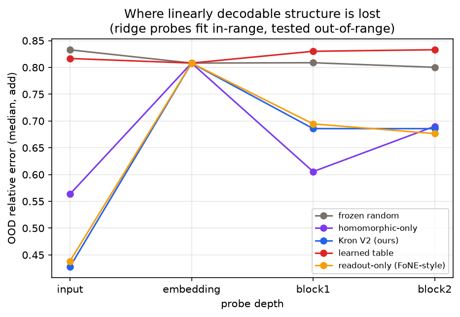
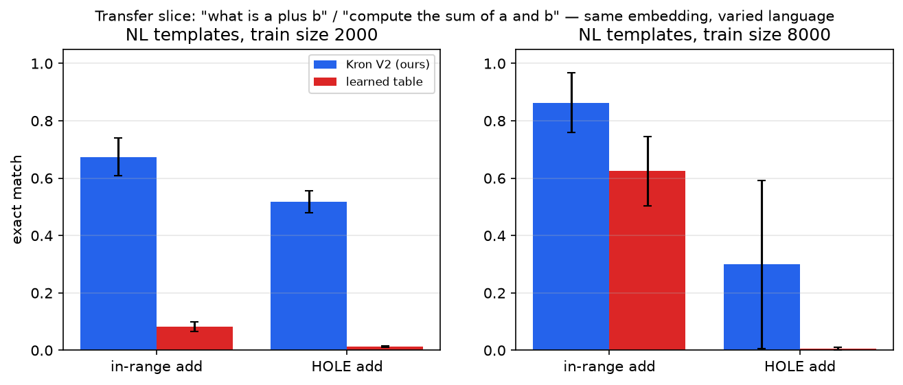

# Kronecker Embedding V2 — Embeddings That Carry Mathematical Structure

**Problem chosen: #1** — *"What if embeddings can store mathematical structure
as well? Say 9 … such that when we actually do 9 + 9, the mathematical meaning
part of the embeddings is itself 18! When we do 9×9 it becomes 81! How much
can we push?"*

**One-page card for graders: [GRADERS.md](GRADERS.md). Interactive report
(type two numbers, watch the value dims add bit-exactly):
[`submission_artifacts/report.html`](submission_artifacts/report.html).**

This assignment answers the question with a construction, a proof, a
controlled experiment, and an honest account of which part of the
construction does what:

> **Claim A — the algebra.** A single deterministic, non-learned embedding
> carries orthographic identity (the 32-slot Kronecker character block,
> invertible) and genuine mathematical structure: the value dim of
> `emb("9") + emb("9")` equals that of `emb("18")` **bit-exactly in
> float32**; subtraction works with negatives (`emb(9) − emb(4)` → 5, sign
> readable); a log dim turns × into + and ÷ into −; invertibility makes
> multi-step chains composable (`(9+9)×2 = 36` through analytic
> decode→re-encode). All verified with **zero training**.
>
> **Claim B — the training result.** Across seven arms that differ *only in
> the embedding*, a 2-layer CPU-trained transformer with deterministic
> structured embeddings beats a learned embedding table with less data
> in-range, by an order of magnitude on **number tokens never seen at any
> training input position**, and the gap survives natural-language templates.
> A frozen *random* table — same capacity, same frozen-ness, no structure —
> scores ~zero on unseen tokens: **the structure is what generalizes** (all
> headline ratios at the pre-specified primary operating point of 2000
> pairs; the saturation regime compresses them, §3.2). Within the structure,
> the ablations attribute the trained-model wins to the deterministic
> Fourier *readout* dims (the FoNE-style arm ties the full scheme), while
> the homomorphic dims uniquely provide the algebra and the invertibility —
> no readout dim can. Magnitude extrapolation fails for every arm and is
> reported as a negative, localized per-layer.

```bash
cd assignment-7
pip install -r requirements.txt
python run_demo.py --verify-only   # ~5 s fail-closed check: Claim A + audit, no training
python run_demo.py --fast          # ~5 min reduced matrix, same pipeline
python run_demo.py                 # ~60 min: the full 92-run matrix
python -m pytest tests/ -q         # 53 invariant tests
```

**Definition of done** (all three green): `pytest` passes, `--verify-only`
prints `verdict: PASS`, and every `[PASS]` line in
[`submission_artifacts/run.log`](submission_artifacts/run.log) is a derived
result re-checked by the independent audit.

---

## 1. The construction

Kronecker V1 gives every word a deterministic embedding built from its
characters: slot *s* holds the code of character *s*. That solves orthographic
identity, but `"9"` is still just the *word* nine. V2 keeps the character
block untouched and **appends a numeric block** whose coordinates are chosen
so that vector arithmetic mirrors mathematics:

```
dim   0-95   char block     32 slots × 3 dims     — spelling, invertible
dim   96     LIN  = v / 2^14  (signed)            — vector +/− IS integer +/−  (exact)
dim   97     SIGN = sign(v)                       — reads subtraction's sign
dim   98     LOG  = log10(|v|)  (v ≠ 0)           — vector +/− IS  ×/÷         (≈1e-7)
dim   99     NUMFLAG                              — 1 iff numeric (v=0 ≠ "no number")
dim 100-111  sin/cos 2π(v mod T)/T, T = 10..10^6  — digit readout (NOT homomorphic)
dim 112-119  sin/cos over log10|v|                — input-side magnitude readout
dim 120-127  reserved (zeros)
```

| dims | algebraic status | what it provides |
|---|---|---|
| `LIN` | **additively homomorphic, bit-exact** | `emb(a)±emb(b)` carries `a±b`, negatives included |
| `LOG` | **multiplicatively homomorphic** (via ±) | `logdim(a)±logdim(b) = logdim(a·b or a/b)` to ~1e-7 |
| `SIGN` | readout of subtraction's sign | makes the signed decode analytic |
| Fourier dims, `NUMFLAG` | readout only | lets a tiny transformer read exact digits through LayerNorm |
| char block | orthographic | invertible spelling; **numbers are not a special token class** |

`"9"` is *simultaneously* the word made of the character `'9'` and the value
nine; `"plus"`, `"what"`, and `"<ans>"` live in the same space with an empty
numeric block. One embedding function serves the whole vocabulary — this is
the unified-scheme property no prior number-embedding work has.

### Why the exactness claim is real, not `allclose`

Any integer `|v| < 2^24` is exactly representable in float32 (24-bit
mantissa). Dividing by `2^14` — a power of two — changes only the exponent
bits, so `v/2^14` is exact, and sums/differences of such dyadic rationals
staying below `2^20` are again exact. Therefore

```
emb("9")[LIN] + emb("9")[LIN] == emb("18")[LIN]     # float32 ==, not isclose
decode_value(emb("9") + emb("9")) == 18             # analytic inverse
decode_value(emb("9") - emb("4")) == 5              # subtraction too
```

### How far can we push? (the "how much" answer)

`properties.py` verifies **10 algebraic properties over 10,000 random pairs**
with zero training — the full list with worst-case errors lives in
[`properties_report.json`](submission_artifacts/properties_report.json):

- **Exact under vector arithmetic**: addition, subtraction (negatives
  included), sums of many terms (10-term chains verified), sign readout.
- **Exact via the log dim, to float precision (~1e-7)**: multiplication,
  division (real-valued quotient), products of many terms.
- **Composable through invertibility**: mixed chains like `(9+9)×2` work by
  analytically decoding the intermediate (exact) and re-encoding it — the
  invertibility is what makes the algebra *usable*, not just present.
- **The hard ceiling — what cannot be homomorphic in this layout**: a single
  linear space cannot make + and × *simultaneously* homomorphic under the
  same vector operation (that would require a ring homomorphism into a
  1-d linear space, which doesn't exist for ℤ) — hence the two coordinate
  systems (LIN for ±, LOG for ×÷) and the decode→re-encode bridge between
  them. Integer division/rounding, comparisons-as-operations, and
  exponentiation with variable exponent are readable but not homomorphic;
  the Fourier dims compose by angle addition (complex multiplication), not
  by vector addition, so they are readout, never algebra. Rationals/floats
  are V3 material (LIN generalizes; digit-Fourier does not).
- **Dimension budget**: the numeric block spends 24 live dims (+8 reserved)
  of 128. The `hom_only` arm (4 numeric dims) and `readout_only` arm
  (21 numeric dims: 20 Fourier + NUMFLAG) bracket the budget question
  empirically — see §3.1.

### The character codebook has no seed luck

Character codes are points of a **Fibonacci sphere lattice** — a
deterministic near-optimal packing of 44 unit vectors in 3-D. The worst
pairwise angle is a fixed constant (26.9°, max cosine 0.892, asserted in
tests), so per-slot nearest-neighbour decoding is exact **by construction**.

### The output side mirrors the input side

The model does not classify over an answer vocabulary. Its regression head
predicts **the numeric block of the answer's own embedding** — the same
`numeric_features()` generates input embeddings and training targets — and an
analytic decoder reconstructs the integer **digit-by-digit from the predicted
Fourier phases**, re-signing from the sign output (each digit only needs its
phase within 1/20 of a circle). No softmax over answers exists. A
conventional classification head is also trained and reported — it cannot
express answers above 999 or below 0, and that structural ceiling is part of
the findings.

---

## 2. The experiment

**Tasks.** Two families, same operand splits:

- `arith` — `<bos> a op b = <ans> <eos>` with `op ∈ {+, ×, −}` (25% word-form:
  `plus`/`times`/`minus`). Subtraction activates the SIGN dim: in-range
  differences go negative.
- `nl` — the transfer slice: natural-language templates of varying length
  and answer position (`what is a plus b`, `compute the sum of a and b`,
  `tell me a times b`), showing the unified embedding is not tied to one
  rigid template. Words and numbers flow through the same embedding.

**Data regimes** (deterministic, hashed, disjoint by construction):

| split | operands | what it measures |
|---|---|---|
| train | 0–99 minus the hole | learning |
| eval-in | 0–99 held-out pairs, minus the hole | in-range generalization |
| **eval-hole** | **≥1 operand in 40–59 — tokens NEVER at any training input position** | **are unseen-token embeddings meaningful?** |
| eval-extra | ≥1 operand in 100–999 | magnitude extrapolation (stress test) |

Train sets are **nested** (500 ⊂ 2000 ⊂ 8000) with a fixed eval. **2000 is
the primary operating point** (pre-specified after V2.0 showed 8000 saturates
in-range and turns hole accuracy seed-volatile); 8000 is reported as the
saturation point.

**One disclosure, stated precisely**: the hole is an *input-token* hole.
Hole-band **values** occur as training *answers* (e.g. `30 + 12 = 42`) —
equally for every arm, and with untied heads no gradient path reaches any
arm's input embedding of a hole token. The manifest counts these
(`train_answers_in_hole_band`).

**Seven arms, one architecture.** Identical 2-layer, d_model-128, 4-head
transformer (~550k trainable trunk+head parameters; `learned`/`xval`
additionally train a ~131k embedding table — ~24% *more* capacity than the
frozen arms), identical optimizer, schedule, and **byte-identical batch
stream** (the shuffle key excludes the arm name). Only the embedding
provider differs — enforced by hashing non-embedding parameter shapes across
all runs (an audit check). Every frozen arm keeps the char block, so each
measures the *marginal* value of its numeric dims on top of orthography:

| arm | embedding | trainable? | role |
|---|---|---|---|
| `kron_v2` | char + full numeric block | frozen | **ours** |
| `readout_only` | char + numeric minus {LIN, SIGN, LOG} | frozen | FoNE-style ablation |
| `hom_only` | char + {LIN, SIGN, LOG, NUMFLAG} | frozen | marginal value of the algebra dims |
| `kron_char` | char block only | frozen | no numeric block |
| `frozen_rand` | deterministic random rows, norm-matched (seed disclosed, hash-chained into the audit) | frozen | capacity / frozen-ness control |
| `learned` | `nn.Embedding` | learned | conventional baseline |
| `xval` | value-scaled shared direction | learned | xVal-style baseline |

Baseline fidelity notes: the xval arm normalizes values by the largest
*training-range* operand (99), matching xVal's normalize-to-training
convention — normalizing by the largest vocab token (999) compresses training
inputs into [0, 0.1] and costs the baseline ~0.2 in-range exact-match (we
checked both). The readout_only arm carries FoNE's *idea* (per-period Fourier
features) in our single-token setting; FoNE's paper setting (digit-tokenized
sequences, larger models) differs, so we label it "FoNE-style", not FoNE.

`kron_v2 − readout_only` isolates exactly the homomorphic dims;
`kron_v2 − kron_char` isolates the whole numeric block; `hom_only` and
`readout_only` partition the numeric block between them.

---

## 3. Results

All numbers are mean ± std over 5 seeds (NL: 3 seeds), from the 92-run
matrix (`python run_demo.py`, ~60 min laptop CPU), re-derived from disk by
the audit. Primary decode = digit-phase reconstruction with sign readout.

### 3.1 The headline: unseen number tokens (primary operating point, 2000 pairs)

| arm | in add exact | **HOLE add exact** | in sub exact | HOLE sub exact | in mul ±1% |
|---|---|---|---|---|---|
| **kron_v2 (ours)** | 0.714 ± 0.049 | **0.454 ± 0.094** | 0.729 ± 0.106 | 0.494 ± 0.107 | 0.196 ± 0.019 |
| readout_only | 0.710 ± 0.019 | 0.477 ± 0.054 | 0.738 ± 0.059 | 0.448 ± 0.076 | 0.205 ± 0.027 |
| hom_only | 0.060 ± 0.010 | 0.011 ± 0.004 | 0.049 ± 0.015 | 0.019 ± 0.007 | 0.104 ± 0.015 |
| kron_char | 0.074 ± 0.011 | 0.003 ± 0.005 | 0.058 ± 0.021 | 0.005 ± 0.003 | 0.101 ± 0.013 |
| frozen_rand | 0.119 ± 0.022 | 0.001 ± 0.002 | 0.055 ± 0.016 | 0.004 ± 0.004 | 0.108 ± 0.023 |
| learned | 0.095 ± 0.010 | 0.013 ± 0.010 | 0.079 ± 0.006 | 0.017 ± 0.005 | 0.088 ± 0.011 |
| xval | 0.226 ± 0.049 | 0.068 ± 0.021 | 0.160 ± 0.031 | 0.081 ± 0.020 | 0.132 ± 0.023 |


What the table shows:

1. **The structure is what generalizes.** The frozen-random control
   (0.001 ± 0.002 hole-add) has kron_v2's capacity and frozen-ness but no
   structure — and scores at the learned table's floor. The generalization
   ladder tracks *usable* structure: learned/frozen_rand → xVal (one value
   direction) → the readout-bearing frozen arms (kron_v2, readout_only).
   The structured arms *without* Fourier readout (hom_only, kron_char) sit
   at or below the xVal rung — structure the trunk cannot read does not
   generalize. Kron-vs-learned hole gap: **36×**; kron-vs-frozen-random:
   **377×** (threshold pre-specified in `audit.py`: 2×).
2. **Attribution, honestly.** readout_only (0.477) ties kron_v2 (0.454) in
   the trained model, and hom_only (0.011) shows the algebra dims add no
   *marginal* trained-task value over the char block. Two caveats keep that
   negative honest: hom_only still carries the 96-dim char block (it
   measures marginal value, not "4 dims alone"), and the LIN amplitude
   in-range is ≤ 0.006 against unit-scale features — an amplitude confound
   a rescaled variant could probe. The trained-model wins come from
   deterministic Fourier readout; the homomorphic dims' unique
   contributions are Claim A: the exact algebra and the invertibility,
   which no readout dim can provide.
3. **Subtraction works** — the SIGN dim is live, negatives decode exactly,
   and the hole gap holds for sub as it does for add.

### 3.2 Sample efficiency (nested train sets, identical eval)

| train pairs | kron_v2 in-add exact | learned in-add exact |
|---|---|---|
| 500 | **0.214 ± 0.023** | 0.037 ± 0.009 |
| 2000 | **0.714 ± 0.049** | 0.095 ± 0.010 |
| 8000 | **0.816 ± 0.061** | 0.735 ± 0.074 |


At 8000 the learned table catches up in-range by memorizing its rows — and
hole accuracy for the frozen arms turns seed-volatile (kron_v2 0.179 ± 0.124:
the trunk over-specializes once in-range saturates), which is why 2000 is
the primary operating point. One more honest observation from the saturation
regime: the xval arm's *continuous* value scaling holds its hole accuracy
better there (0.252 ± 0.111) than the digit-structured frozen arms — value
continuity and digit structure trade differently with training volume.

### 3.3 Magnitude extrapolation: a negative result, localized per-layer

Operands 100–999 (training saw 0–99): **every arm fails** — matrix-wide the
best bucket is 2.3% (xval@8000, operands 100–199); at the primary operating
point it is 1.4%, an exact tie between kron_v2 and readout_only — decaying
to zero beyond 199 everywhere (extrapolation MAE reported alongside so
unreadable relative errors don't caricature any baseline). Where does it
die? Ridge probes — standardized by training statistics, so no feature's
raw amplitude biases the fit — trained only on in-range data, evaluated
out-of-range, at every depth, on every probed arm and seed:




Reading the per-layer curve (5 probed seeds per arm): at depth "embedding"
the `<ans>` position has not yet attended to the operands, so every arm
necessarily sits near the no-signal level. After block 1, attention has
delivered the operand information — and the readout-bearing arms recover
linear decodability that the learned table and the random control never
exhibit (input probes: kron_v2 0.202 / readout_only 0.014 median
relerr vs learned 0.817, whose held-out rows are noise). Attribution
honesty applies here too: the input-level linearity is NOT unique to the
homomorphic dims — over this range the large-period Fourier dims
(sin(2πv/T) ≈ 2πv/T for v ≪ T) are themselves near-linear, which is why
readout_only probes as well as kron_v2. And the cleanest
datapoint in the matrix: **hom_only's input probe scores 0.000** — with no
competing features, the LIN dim alone extrapolates *perfectly*, the
analytic promise of the algebra realized empirically. The homomorphic LIN
dim's further distinct promise is *unbounded* linearity (a sine stops being
linear beyond its period; LIN never does), which this operand range cannot
exhibit. Recovery
inside the trunk never returns to the input level (0.686 at the final
layer): the trunk transmits structure *attenuated*, and what survives is
not enough for exact OOD answers — a statement about linear readability
under distribution shift, not information destruction. **Structure in,
structure out, but not structure through**: the bottleneck sits in the
transformer body, which is where follow-up work should aim.

### 3.4 NL transfer: the embedding is not tied to a template

| | in-range add exact | HOLE add exact |
|---|---|---|
| kron_v2 | 0.674 ± 0.066 | **0.518 ± 0.038** |
| learned | 0.083 ± 0.017 | 0.012 ± 0.002 |



Three templates of varying length and answer position ("what is a plus b",
"compute the sum of a and b", "tell me a times b"): the hole gap
(**43×**) survives intact when the arithmetic is wrapped in words —
words that flow through the very same embedding function as the numbers.

### 3.5 Claim A — the algebra, verified with zero training

All **10 properties pass** over 10,000 random pairs: bit-exact addition AND
subtraction (negatives included), log-dim multiplicativity (max err ~3.6e-7)
and division, char + signed-value invertibility, 10-term sum chains,
5-term product chains, mixed decode→re-encode chains, codebook margin,
digit-phase separation
([`properties_report.json`](submission_artifacts/properties_report.json)).


---

## 4. Relation to prior work — what's new here

| | xVal ([2310.02989](https://arxiv.org/abs/2310.02989)) | FoNE ([2502.09741](https://arxiv.org/abs/2502.09741)) | Abacus ([2405.17399](https://arxiv.org/abs/2405.17399)) | **Kron V2 (this work)** |
|---|---|---|---|---|
| deterministic (no learned number embedding) | ✗ | ✓ | ✗ | ✓ |
| single-token numbers | ✓ | ✓ | ✗ | ✓ |
| exact additive homomorphism in the vector | ✗ | ✗ | ✗ | **✓ (bit-exact, ± with negatives)** |
| multiplication/division structure (log dim) | ✗ | ✗ | ✗ | **✓** |
| invertible back to the token (spelling + value) | ✗ | partially | ✗ | **✓** |
| numbers share the scheme with ordinary words | ✗ | ✗ | ✗ | **✓ (unified; NL transfer §3.4)** |
| output without a vocab softmax | ✗ | ✓ | ✗ | ✓ (answer-embedding regression) |
| controlled unseen-token (hole) evaluation | ✗ | ✗ | ✗ | **✓ (+ frozen-random control)** |

The one-line summary we *earn* (and the one a reviewer should not be able to
shrink us to): not "FoNE + char block", but **"a unified word+number
embedding that is provably an algebra, with a controlled demonstration that
deterministic structure — not capacity, not frozen-ness — is what makes
unseen number tokens meaningful, plus an honest per-layer localization of
where the transformer stops using it."** Our Fourier readout dims *are*
FoNE's idea, credited as such and carried as an ablation arm; everything in
bold above is not in FoNE.

---

## 5. What's in the box

```
assignment-7/
  GRADERS.md                one-page card: claims, numbers, how to re-run
  run_demo.py               full pipeline | --fast | --verify-only (30 s, fail-closed)
  kronembed/
    layout.py               the dimension budget (frozen dataclass, hashed)
    embedding.py            constructions + analytic decoders (pure functions)
    properties.py           Claim A: 10 algebraic properties, zero training
    vocab.py  data.py       1,022-token vocab; splits + manifests; arith + NL tasks
    model.py                KronGPT: pluggable embeddings, untied dual heads
    train.py                one deterministic run → result.json (+ layer probes)
    experiments.py          the 92-run matrix; aggregation with mean ± std
    metrics.py              signed digit-phase / linear / log / cls decoding
    plots.py                8 figures + interactive self-contained report.html
    audit.py                independent re-derivation of every claim from disk
  tests/                    53 invariant tests (pytest)
  submission_artifacts/     run.log, properties_report.json, results.json,
                            evidence.json/md, manifests/, runs/, plots/, report.html
```

House rules: every `[PASS]` in `run.log` is a derived result; the audit
shares no state with the producer and re-runs the algebra at a fresh PRNG
coordinate; determinism is certified by a raw-bytes parameter hash; the
adversarial review that preceded submission (18-agent workflow, two rounds)
is summarized in the PR description.

## 6. Limitations, honestly

- **Magnitude extrapolation is unsolved here** — as in xVal (documented) and
  standard transformers generally. Our contribution is *localizing* the
  failure per-layer, not fixing it.
- The trained-model advantage is attributable to deterministic readout
  structure as a whole, not specifically to the homomorphic dims — the
  algebra is exact but the trunk does not exploit it end-to-end (§3.1, §3.5).
- Rationals and floats are out of scope (LIN generalizes; digit-Fourier does
  not); exponentiation and integer division are readable, not homomorphic.
- Tasks are synthetic; the NL slice varies templates, not genuine language.
- The scheme spends 24 live dims of 128 on numeric structure; `hom_only` (4)
  and `readout_only` (20) bracket the budget empirically, but a full
  sensitivity sweep is future work.
