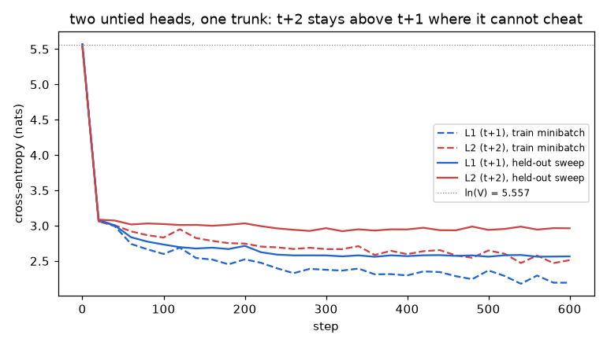
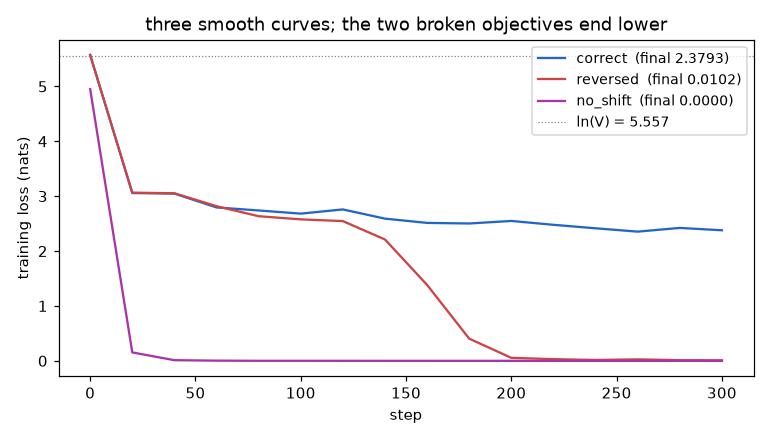
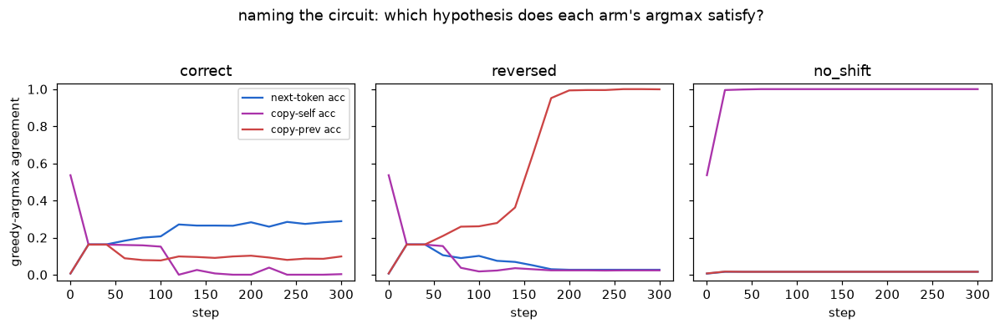

# The Last Inch — Silent Failures Between the Model Output and the Scalar

**Assignment 9 — the loss harness.** *"One notebook, one loss harness, and one thing you
have to get right by reading rather than by guessing. […] A target shift in the incorrect
direction can produce a beautiful loss curve. Print the strings. Many serious training
bugs live in the few lines between the model output and the scalar, and they do not
always raise an exception."*

**One-page card for graders: [GRADERS.md](GRADERS.md). The notebook:
[`loss_harness.ipynb`](loss_harness.ipynb) — committed fully executed, runs top to bottom
on CPU or GPU with zero installs and zero downloads.**

[](https://colab.research.google.com/github/shankarpandala/era-v5/blob/main/assignment-9/loss_harness.ipynb)

Everything in language-model training funnels through three lines:

```python
hidden = model(tokens)
logits = output_head(hidden)
loss   = cross_entropy(logits[:, :-1].reshape(-1, vocab_size),
                       tokens[:, 1:].reshape(-1))
```

This assignment makes those three lines **correct and observable**, then demonstrates —
on itself — why "observable" is not optional:

> **Claim A — the harness.** All seven Part-1 requirements, measured and re-derived from
> disk by an independent audit (`audit.py`, which never executes the notebook): shapes
> with named dimensions; a string-level audit that names all three candidate alignments
> before any training (correct-arm match rate exactly **1.0000**); padding masks that
> change the contributing count from **508** to **186** (loss **10.3600** unmasked vs
> **2.2887** masked) *plus the wrong-reduction bug that silently reads **0.8380** and
> scales every real gradient by **0.366***; two packed documents whose seam decomposes
> into a learnable slot (**0.3934** nats) and an impossible one (**6.8680** nats), mean
> falling **2.5564 → 2.5363** when the seam is masked; untrained perplexity **261.3**
> against V = 259; tied-vs-untied counts **495,488** vs **528,640** (Δ exactly V·d =
> **33,152**); and three cross-entropy implementations proven equivalent to the
> gradient, whose largest logits buffer shrinks **785.3 → 24.5 → 32.0 MiB** at the GPT-2
> vocabulary — the online-softmax variant's buffer **independent of V entirely**
> (measured on this machine: ≈2,379 → ≈181 → ≈170 MiB loss-attributable peaks, a 13×
> reduction; the analytic column is the machine-independent, audited claim).
>
> **Claim B — the leak the harness caught in itself.** With the standard **tied** head,
> the no-shift objective beats uniform *before a single optimizer step*: CE **4.9660**,
> perplexity **143.5**, against ln(259) = **5.5568** — because the residual stream still
> carries `tok_emb[t]` and the tied head dots it with itself. Untie the head and the
> leak vanishes (**265.0**). No-shift + weight tying is not a training bug; it is an
> **architectural identity, visible at initialization** — precisely where the PPL ≈ V
> check promised to look.
>
> **Claim C — the warning, quantified and the circuits named.** Under identical budgets
> both classic shift bugs end far below the correct objective — **0.0102** (reversed)
> and **0.0000** (no shift) against **2.3793** — and the copy-accuracy instrument names
> each circuit from behavior alone: reversed drives copy-prev agreement to **0.999**,
> no-shift drives copy-self to **1.000**, while the correct arm's next-token accuracy
> (**0.288**) dwarfs its copy scores. The two bugs are *different machines*: no-shift
> collapses within ~20 steps (its wire is Claim B's identity), reversed tracks the
> correct arm for ~140 steps and then falls off a cliff once attention learns
> attend-back-and-copy. The loss curve shows none of this.

```bash
cd assignment-9
pip install -r requirements.txt
python run_demo.py --verify-only   # ~5 s: independent audit of the committed artifacts
python run_demo.py --fast          # ~40 s smoke run, reduced budgets, same pipeline
python run_demo.py                 # ~2 min CPU: full re-run, rewrites every artifact
python -m pytest tests -q          # 40 invariant tests (they exec the notebook's cells)
```

**Definition of done** (all three green): `pytest` passes, `--verify-only` prints
`verdict: PASS`, and every number in this README is quoted verbatim from
[`submission_artifacts/results.json`](submission_artifacts/results.json) — the audit
fails if any number here drifts from what the run produced.

---

## Requirement checklist

| # | requirement | where | the number |
|---|---|---|---|
| 1 | every tensor shape + one line per dimension | notebook §3 | `logits (8, 128, 259)`; 8 tensors explained |
| 2 | verify the shift with token **strings** | notebook §4 | all 3 alignments audited pre-training; correct rate **1.0000** |
| 3 | mask padding; contributing count changes | notebook §5–5b | **508** → **186** slots; SFT variant **64** → **16** |
| 4 | pack two docs; mask the boundary; loss before/after | notebook §6 | **2.5564** → **2.5363**; seam slots **0.3934** / **6.8680** |
| 5 | untrained perplexity ≈ vocab size | notebook §7 | PPL **261.3**; tied no-shift leaks to **143.5** at init |
| 6 | tied vs untied parameter counts | notebook §8 | **495,488** vs **528,640** (Δ **33,152**) |
| 7 | peak memory, ordinary vs chunked CE | notebook §9 | largest buffer **785.3** / **24.5** / **32.0** MiB (measured ≈2,379/181/170) |
| P2 | second head predicting t+2, both losses + sum | notebook §10 | held-out sweep: L1 **2.5650**, L2 **2.9629**, sum **5.5278** |
| P3 | wrong shifts ⇒ beautiful curves; instruments catch them | notebook §11 | **0.0102** / **0.0000** vs **2.3793**; circuits named by accuracy |

Submission = this README. The notebook is the primary artifact and carries the same
story cell by cell; every instrument below exists because a plausible narrative once
failed against the data — including two of this write-up's own earlier claims, caught by
adversarial review and rebuilt (see §8).

## 1. The three lines, and how they fail silently

Nothing in PyTorch's type system distinguishes the correct slicing from the wrong ones:
`logits[:, :-1]` vs `tokens[:, 1:]` (correct), `logits[:, 1:]` vs `tokens[:, :-1]` (each
position asked to repeat the token it just read), and no slicing at all (each position
asked to copy its own input). All three run, all three backpropagate, all three produce
smooth decreasing curves — the broken two faster and lower. The same silence covers the
denominator (a mask that stops changing the contributing count is decoration; a
`.mean()` after a mask-multiply is a hidden learning-rate schedule), the initialization
(a tied head plus a residual stream is a pre-built copy machine), and the precision (an
fp16 exponential overflows at logit 12 without raising). Alignment and accounting are
semantic properties. The harness makes them observable: named shapes, printed strings,
counted tokens, init-time identities, and behavioral accuracies no scalar can fake.

## 2. Setup

Self-contained and deterministic (seed 1337; every audited number reproduces
bit-identically on CPU — only the un-audited measured memory peaks are
machine-specific):

| component | choice | why |
|---|---|---|
| tokenizer | byte-level, V = 259 (`<pad>/<bos>/<eos>` + 256 bytes), inline | every id decodes to a printable string — the string audit needs totality; `ln(259) = 5.5568` makes requirement 5 crisp |
| corpus | ~6.6 KB, 10 self-authored documents in two registers (prose about loss functions + pseudo-code), 2 held out | two registers make the packing seam readable; the corpus *describes the harness that trains on it* |
| model | `TinyLM`: 2-layer pre-norm transformer, d = 128, 4 heads, tied head by default, GPT init (std 0.02, shared storage initialized once) | `trunk()`/`head` split lets the notebook run the assignment's snippet literally; `segment_ids` switch on block-causal packing attention |
| training | AdamW lr 3e-3, B = 8, T = 128, 300 steps per bug-zoo arm, 600 for Part 2; crops reach every window | identical init, crop stream, and budget across arms — the arms differ **only** in the two slicing lines |
| evaluation | full-stream sweeps (consecutive windows, every target once); step 0 logged **before** the first update | a frozen batch of random crops from 1,239 held-out tokens is not "the held-out loss" |
| memory experiment | standalone head at N = 4,096 rows, V = 50,257 (the GPT-2 vocabulary) | requirement 7 is a large-vocabulary phenomenon; measuring it at V = 259 would be theater |

## 3. Part 1 — the seven numbers

### 3.1 Shapes, with every dimension named

`explain()` prints one line per tensor: shape, dtype, and each dimension's meaning —
`tokens (8, 128)` [batch sequences × positions], `hidden (8, 128, 128)` [+ model width],
`logits (8, 128, 259)` [+ one score per vocabulary id], the shifted pair `(8, 127, 259)`
vs `(8, 127)`, and the flattened views `(1016, 259)` / `(1016,)` where most silent bugs
enter — `reshape(-1, V)` will happily flatten a mis-sliced tensor.

### 3.2 The shift, verified in strings — all three alignments, before training

The audit table (position row width-matched so positions ≥ 10 stay readable — v1 of this
notebook smashed them into `910111213`, its own wall of integers, caught in review):

```
position:  0 1 2 3 4 5 6 7 8 9 10 11 12 13
input   :  t , ␣ r e d u c t i  o  n  ␣  =    (last token read)
target  :  , ␣ r e d u c t i o  n  ␣  =  ␣    (token demanded)
```

The correct arm's target row is the input row slid one step left; match rate at offset
+1 is exactly **1.0000** while the accidental offsets sit near 0.04–0.06. The same
instrument is run on the reversed and no-shift constructions *on the same untrained
batch* — the reader sees what each bug looks like in strings before §11 shows how
beautifully it trains. `targets == tokens[:, 1:]` is also asserted as a tensor identity.

### 3.3 Padding: mask it, count it, and divide by the right number

Four documents padded to one rectangle — **508** target slots, **186** real. The trained
model has never predicted `<pad>`, so the unmasked mean is contaminated, not just
diluted: **10.3600** unmasked vs **2.2887** masked; the float-multiply mask and
`ignore_index=-100` agree to float precision; rewriting every pad id moves the masked
loss by exactly nothing. Then the bug the review demanded, the one production actually
ships:

| reduction | value | what it does |
|---|---|---|
| `(per_tok * mask).sum() / mask.sum()` | **2.2887** | the estimator |
| `(per_tok * mask).mean()` | **0.8380** | divides by 508, not 186 — looks *better*, is wrong |

No exception. The wrong number is prettier, and every real token's gradient is silently
scaled by **0.366** — a hidden learning-rate discount that changes with each batch's
padding ratio.

**§5b, the same bug at higher stakes:** completions-only SFT. A prompt+completion pair
has **64** target slots of which only **16** belong to the completion; the notebook
prints the prompt/completion boundary in strings and scores both ways. Prompt tokens are
padding that happens to carry meaning: read, never scored.

### 3.4 Packing two documents: the seam has an anatomy

`<bos> prose <eos> <bos> code <eos> <pad>…`, per-token receipts printed by the trained
model. The two seam target slots behave completely differently, and *that* is the
result — the means are bookkeeping:

```
pos 64: read <eos> -> demand <bos>   loss 0.3934   <- notation: learnable
pos 65: read <bos> -> demand     M   loss 6.8680   <- WHICH doc comes next: impossible
```

`<eos> → <bos>` is grammar the training stream teaches on every document join (the
notebook prints an ordinary training crop crossing a seam — random-crop training *is*
packed data without a packing contract). `<bos> → first content byte` is genuinely
unanswerable from the wrong document's context and spikes to ~2.7× the sequence mean.
Masking exactly those two slots moves the mean **2.5564 → 2.5363** over 109 → 107
targets, and nothing else changes. The audit checks the two slots *separately* (easy <
mean < hard), not their average.

The deeper fix is ablated into its two ingredients: (b) block-causal attention alone is
**not** enough (doc 2 still sits at shifted positions; its losses differ from
doc-2-alone), while (c) block-causal **plus per-document position restart** makes doc
2's per-token losses match a doc-2-alone run to `allclose(atol=1e-4)`. Whether isolation
raises or lowers the mean is incidental and run-dependent; the contract's claim is the
identity, not a direction.

And the contract does not stay in the demo: **§6c retrains the correct arm with the full
packing contract inside the training loop** — segment ids from the `<bos>` boundaries,
per-document position restart, cross-seam slots dropped (0.12% of target slots on the
training distribution, measured over 50 batches so the mask is visibly not decoration).
Same seed, crops, and budget; the loop learns under the contract (final train loss
**2.3629**, held-out sweep under its own protocol **2.6086**). Each arm is evaluated
under its own protocol — comparing across protocols would compare different objectives,
which is this section's whole lesson.

### 3.5 An untrained model must sit at perplexity ≈ V — and the check finds a real leak

Measured at init on held-out text: CE **5.5656** vs ln(259) = **5.5568**, perplexity
**261.3** vs V = 259. The counterexample still stands (std = 1.0 init: CE **33.3466**).
Then the diagnostic is pointed at the harness itself — all three §4 alignments, tied and
untied:

| arm | tied CE | tied PPL | untied CE | untied PPL |
|---|---|---|---|---|
| correct | 5.5828 | 265.9 | 5.5668 | 261.6 |
| reversed | 5.5722 | 263.1 | 5.5618 | 260.3 |
| no_shift | **4.9660** | **143.5** | 5.5796 | **265.0** |

Tied + no-shift beats uniform by 0.59 nats **before any training**: the residual stream
still carries `tok_emb[t]`, the tied head is a dot product against the embedding table,
so the input token's own logit is inflated at initialization. The same leak is visible in
argmax space — the untrained tied model already agrees with the copy-self hypothesis at
~0.48 (chance is 1/259) — and it is why §11's no-shift arm collapses instantly. Both
*shifted* tied arms stay at PPL ≈ V: the leak is specific to the identity target.
Audited as three predicates.

### 3.6 Tied vs untied, in parameters

**495,488** tied vs **528,640** untied; the difference is verified to be exactly
`V·d = 259 × 128` = **33,152** (6.3% of the untied model), and the shared storage is
initialized once, not re-rolled. The same arithmetic at the §9 GPT-2 vocabulary gives
**6,432,896** — at small scale the head dominates, which is why small models tie; §3.5
is the other side of that trade.

### 3.7 Peak memory: three cross-entropies, one gradient

At N = 4,096, V = 50,257 the logits are 785.3 MiB and plain CE holds roughly three such
buffers. Three implementations, all proven the same estimator (loss and both gradients
`allclose` at 1e-6, `ignore_index` rows and non-divisor chunks included):

| implementation | largest logits buffer (analytic — **the audited claim**) | measured on this Linux container (machine-specific) |
|---|---|---|
| plain CE | `[N, V]` = **785.3** MiB | ≈2,379 MiB |
| row-chunked + checkpoint | `[128, V]` = **24.5** MiB | ≈181 MiB (13.2×) |
| online-softmax (vocab-chunked) | `[N, 2,048]` = **32.0** MiB — **independent of V** | ≈170 MiB (14.0×) |

The online implementation is the mechanism behind Cut-CE/Liger kernels in miniature: a
streaming logsumexp forward and a hand-written backward that recomputes each vocabulary
slice and applies `softmax − onehot` chunk by chunk — the vocabulary dimension is never
materialized at all. The measured chunked/online peaks sit far above their analytic
buffers because chunking cannot remove fixed costs (the persistent `[V, d]` weight
gradient ≈ 24.5 MiB, input gradients, recompute transients, allocator slack) — the
measured ratios *understate* the logits-storage ratios. **Only the analytic column is
audited** — it is deterministic on any machine, so a full re-run anywhere keeps this
README's verbatim check green; the measured peaks are this container's illustration and
live un-audited in `results.json`. Protocol: CUDA allocator peaks when a GPU is present
(byte-exact); on CPU, fresh subprocesses sampling their own resident set (`/proc` on
Linux, a `getrusage` fallback elsewhere — the cell runs on macOS too, coarsely).

**§9b:** the precision variant of the same silence — `exp(13)` in fp16 is `inf`, a naive
fp16 softmax is `nan` with no exception, and the max-subtraction identity (what §9's
online CE streams) or fp32 loss computation fixes it. Demonstrated, asserted.

## 4. Part 2 — a second head predicting t+2, identified this time

Two heads on one trunk (Gloeckle et al. 2024's parallel-heads MTP; DeepSeek-V3's
sequential variant cited as the at-scale alternative) — and **both heads untied**,
because v1 of this assignment raced a tied t+1 head against a fresh t+2 matrix and §3.5
just proved tying is not innocent; that confound was caught in review. The t+2 alignment
gets its own string audit (`pos | read | t+1 demands | t+2 demands`, exact identity
`targets2[i] == tokens[i+2]` asserted). Instrumentation: step 0 logged **before** the
first update; reported finals are full-stream sweeps, with per-step minibatch values
shown in the plot only.

| split (full-stream sweep) | L1 (t+1) | L2 (t+2) | sum |
|---|---|---|---|
| train | **2.1711** | **2.4816** | **4.6526** |
| held-out | **2.5650** | **2.9629** | **5.5278** |

**What happens to the second head's loss, and why.** At step 0 both heads sit at ln V
and the gap is zero (measured −0.018) — before the model knows anything, one step and two
steps ahead are equally unknowable. Then both losses fall and a gap opens with L2 above
L1 at every subsequent held-out log point, ending at +0.40 nats. Mechanism:
`H(x_{t+2}|x_{≤t}) ≥ H(x_{t+2}|x_{≤t+1})`, whose right side is head 1's own task one step
later (by stationarity) — the gap *is* the information carried by the skipped token, so
it grows as the model learns enough language for that information to matter. The splits
differ honestly: the held-out gap keeps growing late into training (final +0.40); the
train gap plateaus near +0.31, below it — memorization makes the skipped token partly
known, capping what the train gap can be made of.

A third estimator brackets the quantity from the other side: **the same head, asked two
questions** — head 1's logits scored against `tokens[:, 1:]` and `tokens[:, 2:]`. One
matrix, so the two-heads confound vanishes entirely; the remaining bias runs the other
way (head 1 was optimized only for its own shift), and the measurement behaves exactly
as that bias predicts: same-head gap **1.6748**, far above the two-untied-heads gap of
+0.40. The two estimators bracket the true difficulty difference. Audited: step-0 gap
≈ 0, L2 > L1 at every held-out point, train gap ends below held gap, same-head gap
positive and above the two-heads gap.



## 5. Part 3 — the bug zoo: name the circuit, don't admire the curve

Same model, init, crop sequence, optimizer, budget; only the two slicing lines differ:

| arm | final loss | `audit_shift` | next-acc | self-acc | prev-acc | emits |
|---|---|---|---|---|---|---|
| correct | **2.3793** | CORRECT | **0.288** | 0.003 | 0.098 | corpus-register text (4-gram **0.259**) |
| reversed | **0.0102** | REVERSED | 0.027 | 0.023 | **0.999** | `<bos> <bos> <bos> …` (**0.000**) |
| no shift | **0.0000** | IDENTITY | 0.016 | **1.000** | 0.016 | `<bos> <bos> <bos> …` (**0.000**) |




All three curves fall smoothly, the broken two ending orders of magnitude lower — the
assignment's warning, quantified. But the claim-carrying instrument is the second
figure: greedy-argmax agreement with three hypotheses, logged throughout training,
**names the circuit from behavior alone** — reversed builds attend-one-back-and-copy
(prev-acc → 0.999), no-shift amplifies §3.5's pre-existing identity wire (self-acc → 1.000
within ~20 steps), the correct arm predicts without copying. And the two bugs are
*different machines*: no-shift's collapse is instantaneous because its circuit shipped
with the initialization, while reversed tracks the correct arm for ~140 steps before
falling off a cliff — an attention circuit takes time to form. The generation column is
the train/inference mismatch made audible: sampling feeds each output back as the *next*
token, an alignment the buggy models were never trained on, so they emit their own input
— an unbroken `<bos>` run, printed as tokens, not hidden behind an empty decoded string.
The 4-gram rate is reported as color; the accuracies carry the claim.

## 6. Loss-mass accounting

Every target slot of the packed batch, accounted: 115 slots = 6 pad + 2 boundary + 107
contributing (93.0%). In the padded batch of §3.3: **508** slots → **186** contributing,
with the wrong-mean bug silently applying the **0.366** discount to whatever survives.
In §5b's SFT sample: **64** slots → **16** completion targets. If a mask ever stops
changing these counts, it has become decoration.

## 7. Relation to prior work — what is new here

| this notebook | the production-scale counterpart |
|---|---|
| t+2 head on a shared trunk, both heads untied, gap = conditional entropy | multi-token prediction: [Gloeckle et al. 2024, arXiv:2404.19737](https://arxiv.org/abs/2404.19737); sequential MTP in [DeepSeek-V3, arXiv:2412.19437](https://arxiv.org/abs/2412.19437) |
| `online_ce`: streaming logsumexp + chunked `softmax − onehot` backward, V never materialized | [Cut Your Losses, arXiv:2411.09009](https://arxiv.org/abs/2411.09009) (Apple); Liger-Kernel fused CE; online softmax ([Milakov & Gimelshein 2018, arXiv:1805.02867](https://arxiv.org/abs/1805.02867)) |
| `chunked_ce`: checkpointed row-chunks | the teaching form of the same trade |
| tied-head identity leak at init, caught by the PPL ≈ V check | weight tying: [Press & Wolf 2016, arXiv:1608.05859](https://arxiv.org/abs/1608.05859) — with its untaught interaction against no-shift targets made explicit |
| seam anatomy + isolation ablation (mask / +block-causal / +position restart) | sequence composition: [arXiv:2402.13991](https://arxiv.org/abs/2402.13991); [In-Context Pretraining, arXiv:2310.10638](https://arxiv.org/abs/2310.10638) |

The contribution is harness discipline: the string audit as a first-class instrument
with a programmatic verdict; copy-circuit accuracies that name a bug's mechanism; the
init-time leak as a pre-`optimizer.step()` diagnostic; and the audit culture applied to
the loss pipeline itself — every number above re-derived from committed artifacts by
code that never executes the notebook.

## 8. What the reviews changed (nothing retyped, everything re-earned)

This is v2. An adversarial review of v1 found, among smaller items: the string-audit
table smashing positions ≥ 10 (fixed, regression-tested); the tied-vs-untied head
confound in Part 2 (both heads now untied); the no-shift init leak sitting unreported in
v1's own curves (now §3.5, three audit predicates); the wrong-mean reduction missing
from §3.3 (now measured); 4-gram rates carrying more claim than they can hold (demoted
to color; copy accuracies added); a Linux-only memory cell (portable now); and two
narrative claims v1's own data contradicted (train-gap "narrows", corpus size) — both
rewritten to match the artifacts. The audit gained predicates for each so none can
silently regress.

A verification pass on v2 left three items open; this version closes them: machine-
specific RSS measurements are no longer the audited headline (the deterministic analytic
buffers are — a re-run on any hardware keeps the verbatim check green); the same-head
two-shift estimator was added (§4), behaving exactly as its bias predicts; and the
packing contract now runs inside the training loop (§6c), not only in the demo.

## 9. What's in the box

```
assignment-9/
├── loss_harness.ipynb        # THE deliverable: all harness code inline, executed, ~380 KiB
├── run_demo.py               # execute top-to-bottom (nbclient) + audit -> run.log
├── audit.py                  # independent: re-derives every claim from disk
├── requirements.txt
├── tests/                    # 40 tests; conftest exec's the notebook's export cells,
│   ├── conftest.py           #   so tests share the notebook's code — nothing retyped
│   ├── test_notebook_exports.py
│   ├── test_shift_and_shapes.py
│   ├── test_masks_and_packing.py
│   ├── test_chunked_ce.py
│   └── test_heads_params_artifacts.py
└── submission_artifacts/
    ├── results.json          # every number in this README, machine-checked
    ├── loss_curves.json      # losses + copy accuracies, all arms, both parts
    ├── per_token_losses.json # raw per-token vectors behind §3.3/§3.4
    ├── run_config.json  ·  run.log  ·  plots/*.png (4 figures)
```

## 10. Reproduce

`python run_demo.py` re-executes the notebook headlessly and re-audits (~2 min CPU; the
notebook itself is about a minute). `--fast` shrinks every budget; `--verify-only`
audits the committed artifacts in ~5 s. In Colab: open the badge, `Runtime → Run all`;
on a GPU the §9 memory numbers switch to the allocator-exact CUDA path automatically. On
macOS the memory cell falls back to `getrusage` (coarser, but it runs). No pip installs,
no downloads, no repo clone.

Every audited number in this README is deterministic (seeded, CPU) — including the
analytic memory column — so a full re-run on any machine keeps the verbatim check
green. The measured memory peaks in `results.json` are machine-specific by nature and
are quoted here only as rounded illustrations, outside the audit.

## 11. Limitations, honestly

1. **Toy scale.** Byte-level V = 259, 2 layers, ~6.6 KB corpus. The mechanisms measured
   (shift semantics, mask accounting, the init identities, the MTP gap, the CE memory
   cliff) are scale-independent; no claim here is about model quality — the correct
   arm's 300-step samples are corpus-register word-salad, and are described as such.
2. **CPU memory measurements are process-level and machine-specific** — which is why
   they are not audited: the analytic buffer sizes are the claim. The Linux sampler with
   a pinned mmap threshold tracks the allocator well (≈2,379 measured vs ~2,356 analytic
   for three `[N, V]` buffers); the macOS fallback is a high-water mark and coarser; the
   CUDA path is byte-exact.
3. **The corpus is deliberately memorizable** — it makes the train-vs-held gap
   asymmetry visible, but train-split numbers describe memorization dynamics.
4. **Single seed for training curves** (1337). The audited invariants (verdicts,
   orderings, identities, accuracy limits) are the claims; individual loss values would
   wobble under reseeding. Determinism at this seed is pinned by test.
5. **The stationarity clause** in §4's entropy argument is an assumption (a fine one for
   a stationary byte stream), and the measured gap compares two trained heads, not true
   entropies — direction is the claim, magnitude is an estimate.
6. **Notebook markdown numbers** are prose, not audited artifacts; only this README and
   `results.json` are machine-cross-checked. The markdown was hand-synced to the final
   committed run.
