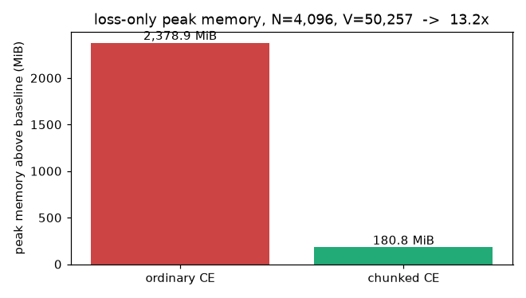

# The Last Inch — Silent Failures Between the Model Output and the Scalar

**Assignment 9 — the loss harness.** *"One notebook, one loss harness, and one thing you
have to get right by reading rather than by guessing. […] A target shift in the incorrect
direction can produce a beautiful loss curve. Print the strings. Many serious training
bugs live in the few lines between the model output and the scalar, and they do not
always raise an exception."*

**One-page card for graders: [GRADERS.md](GRADERS.md). The notebook:
[`loss_harness.ipynb`](loss_harness.ipynb) — committed fully executed, runs top to bottom
on CPU or GPU with zero installs and zero downloads.**

[](https://colab.research.google.com/github/shankarpandala/era-v5/blob/main/assignment-9/loss_harness.ipynb)

Everything in language-model training funnels through three lines:

```python
hidden = model(tokens)
logits = output_head(hidden)
loss   = cross_entropy(logits[:, :-1].reshape(-1, vocab_size),
                       tokens[:, 1:].reshape(-1))
```

This assignment takes those three lines and makes them **correct and observable**, then
demonstrates why "observable" is not optional:

> **Claim A — the harness.** All seven Part-1 requirements are implemented, measured, and
> re-derived from disk by an independent audit (`audit.py`, which never executes the
> notebook): shapes with named dimensions; a string-level shift audit whose correct-arm
> match rate is exactly **1.0000**; padding masks that change the contributing-token
> count from **508** to **186**; two packed documents whose seam is masked with the loss
> falling **2.5550 → 2.5357**; an untrained perplexity of **262.2** against a vocabulary
> of 259; tied-vs-untied head counts of **495,488** vs **528,640** (delta exactly V·d =
> **33,152**); and a self-written chunked cross-entropy that cuts the loss's peak memory
> from **2,378.9 MiB to 180.8 MiB — 13.2×** — at GPT-2 vocabulary scale.
>
> **Claim B — the warning, quantified.** Trained under identical budgets, both classic
> shift bugs produce *smoother, lower* loss curves than the correct objective — final
> loss **0.0045** (reversed shift) and **0.0000** (no shift) against **2.3386**
> (correct) — while generating nothing but `<bos> <bos> <bos> …`. The loss curve cannot
> tell the difference; one screen of printed strings and a 4-gram behavior check can
> (**0.284** vs **0.000** and **0.000**).

```bash
cd assignment-9
pip install -r requirements.txt
python run_demo.py --verify-only   # ~5 s: independent audit of the committed artifacts
python run_demo.py --fast          # ~1 min: reduced budgets, same pipeline end to end
python run_demo.py                 # ~2 min CPU: full re-run, rewrites every artifact
python -m pytest tests -q          # 30 invariant tests (they exec the notebook's cells)
```

**Definition of done** (all three green): `pytest` passes, `--verify-only` prints
`verdict: PASS`, and every number in this README is quoted verbatim from
[`submission_artifacts/results.json`](submission_artifacts/results.json) — the audit
fails if any number here drifts from what the run produced.

---

## Requirement checklist

| # | requirement | where | the number |
|---|---|---|---|
| 1 | every tensor shape + one line per dimension | notebook §3 | `logits (8, 128, 259)`; 8 tensors explained |
| 2 | verify the shift with token **strings** | notebook §4 | correct(+1) match rate **1.0000** |
| 3 | mask padding; contributing count changes | notebook §5 | **508** slots → **186** contributing |
| 4 | pack two docs; mask the boundary; loss before/after | notebook §6 | **2.5550** → **2.5357** |
| 5 | untrained perplexity ≈ vocab size | notebook §7 | PPL **262.2**, V = 259 |
| 6 | tied vs untied parameter counts | notebook §8 | **495,488** vs **528,640** (Δ **33,152**) |
| 7 | peak memory, ordinary vs chunked CE | notebook §9 | **2,378.9** vs **180.8** MiB (**13.2**×) |
| P2 | second head predicting t+2, both losses + sum | notebook §10 | held-out L1 **2.5924**, L2 **2.9745**, sum **5.5668** |
| P3 | wrong shifts ⇒ beautiful curves; strings catch them | notebook §11 | final losses **0.0045** / **0.0000** vs **2.3386** |

Submission = this README. The write-up below reports each number with its mechanism; the
notebook is the primary artifact and carries the same story cell by cell.

## 1. The three lines, and how they fail silently

Nothing in PyTorch's type system distinguishes the correct slicing from the wrong ones:
`logits[:, :-1]` vs `tokens[:, 1:]` (correct), `logits[:, 1:]` vs `tokens[:, :-1]`
(each position asked to repeat the token it just read), and no slicing at all (each
position asked to copy its own input). All three run, all three backpropagate, all three
produce smooth decreasing curves — the broken two *faster and lower*, because the
optimizer only needs to build a copy wire. The same silence covers the denominator: a
mask that stops changing the contributing-token count is decoration, and the mean it
produces is diluted by predictions nobody needed. Alignment and accounting are semantic
properties. The harness makes them observable: named shapes, printed strings, counted
tokens, and a behavioral check that no scalar can fake.

## 2. Setup

Everything is self-contained and deterministic (seed 1337, bit-reproducible on CPU):

| component | choice | why |
|---|---|---|
| tokenizer | byte-level, V = 259 (`<pad>/<bos>/<eos>` + 256 bytes), inline | every id decodes to a printable string — the string audit needs totality; `ln(259) = 5.5568` makes requirement 5 crisp |
| corpus | ~6.6 KB, 10 self-authored documents in two registers (prose about loss functions + pseudo-code), 2 held out | two registers make the packing seam readable; the corpus *describes the harness that trains on it* |
| model | `TinyLM`: 2-layer pre-norm transformer, d = 128, 4 heads, tied head, GPT init (std 0.02) | `trunk()`/`head` split lets the notebook run the assignment's snippet literally; `segment_ids` switch on block-causal packing attention |
| training | AdamW lr 3e-3, B = 8, T = 128, 300 steps per bug-zoo arm, 600 for Part 2 | identical init, crop stream, and budget across arms — the arms differ **only** in the two slicing lines |
| memory experiment | standalone head at N = 4,096 rows, V = 50,257 (the GPT-2 vocabulary) | requirement 7 is a large-vocabulary phenomenon; measuring it at V = 259 would be theater |

## 3. Part 1 — the seven numbers

### 3.1 Shapes, with every dimension named

`explain()` prints one line per tensor: shape, dtype, and the meaning of each dimension —
`tokens (8, 128)` [batch sequences × token positions], `hidden (8, 128, 128)` [+ model
width], `logits (8, 128, 259)` [+ one score per vocabulary id], the shifted pair
`(8, 127, 259)` vs `(8, 127)` (the last position has no target; the first token is never
predicted), and the flattened views `(1016, 259)` / `(1016,)` where most silent bugs
enter — `reshape(-1, V)` will happily flatten a mis-sliced tensor. The step-0 loss
printed at the bottom already sits at ln(259): requirement 5's invariant, visible before
anything is trained.

### 3.2 The shift, verified in strings

For the first sequence of the batch, the notebook prints the last token the model has
read directly above the token the loss demands:

```
position:  0 1 2 3 4 5 6 7 8 9 10 11 12 13
input   :  t , ␣ r e d u c  t  i  o  n  ␣ =   (last token read)
target  :  , ␣ r e d u c t  i  o  n  ␣  =  ␣  (token demanded)
```

The target row is the input row slid one step left — every target is the *next* token.
The programmatic check then measures all three candidate alignments over the whole batch:
target == token at prediction position **+1** matches at rate **1.0000**; the accidental
rates (a character equal to its neighbor) sit near 0.04–0.06. `targets == tokens[:, 1:]`
is also asserted as an exact tensor identity. This instrument — `audit_shift` — returns
in §11 to *name* each bug from the data alone.

### 3.3 Padding, masked and counted

Four documents of very different lengths, padded to one rectangle: **508** target slots,
of which only **186** are real. The trained model has never been asked to predict `<pad>`
(training crops contain none), so the unmasked mean is contaminated, not just diluted:
**10.4337** unmasked vs **2.3146** masked. Three verifications: the count changes (508 →
186); the float-multiply mask and `ignore_index=-100` agree to float precision (2.3146 both
ways — assignment 6 masks the first way, assignment 7 the second, and this notebook proves
they are the same estimator); and *tamper invariance* — rewriting every `<pad>` id to
garbage moves the masked loss by exactly nothing, the proof that pads truly do not
participate.

### 3.4 Packing two documents, masking the seam

One prose document and one pseudo-code document share a sequence:
`<bos> prose <eos> <bos> code <eos> <pad>…`. The per-token losses at the seam, printed in
strings by the trained model:

```
pos 63: read     . -> demand <eos>   loss 2.4340
pos 64: read <eos> -> demand <bos>   loss 0.1466  <-- boundary
pos 65: read <bos> -> demand     n   loss 7.0250  <-- boundary
pos 66: read     n -> demand     o   loss 2.5287
```

The seam's anatomy is precise: `<eos> → <bos>` is *notation* (every document end is
followed by a document start in the stream — learnable, loss 0.15), while `<bos> → n` is
the genuine impossibility — **which** document comes next is not a function of the
previous one, and its loss (7.03) spikes to ~2.7× the sequence average. Masking the two
seam targets removes exactly those slots from numerator and denominator: the mean falls
**2.5550 → 2.5357** over 109 → 107 targets, and nothing else changed. The deeper fix is
also demonstrated: with `segment_ids` block-causal attention and per-document positions,
doc 2 cannot *attend* into doc 1 at all, and its per-token losses become bit-identical to
a run where doc 2 is alone in the sequence (checked with `allclose`, printed `True`).

### 3.5 An untrained model must sit at perplexity ≈ V

Ignorance has an exact score: uniform probability 1/V ⇒ cross-entropy ln V ⇒ perplexity
V. Measured on held-out text at initialization: CE **5.5692** against ln(259) =
**5.5568**, perplexity **262.2** against V = 259. The check brackets the loss from both
sides — far above V means the initialization is too loud (demonstrated concretely: the
same model with std = 1.0 init scores CE **33.1490**, a perplexity of ~2.5 × 10¹⁴), and
below V at step 0 means information is leaking from target to prediction, which is
precisely §11's disease. An untrained model cannot beat uniform; if it does, fix the
harness, not the model.

### 3.6 Tied vs untied, in parameters

The output head is `[V, d]`; the input embedding is `[V, d]`; tying makes them one
storage (Press & Wolf 2016). On this configuration: **495,488** parameters tied vs
**528,640** untied. The difference is verified to be *exactly* `V·d = 259 × 128` =
**33,152** — 6.3% of the untied model. The same arithmetic at the memory experiment's
GPT-2 vocabulary (V = 50,257, d = 128) gives **6,432,896** — there the head dwarfs a
small trunk, which is why small models tie almost universally while the largest models,
whose trunks dwarf `V·d`, increasingly untie.

### 3.7 Peak memory: ordinary vs chunked cross-entropy

At N = 4,096 flattened rows and V = 50,257, the logits tensor alone is 785.3 MiB, and
ordinary cross-entropy holds it plus a same-shaped `log_softmax` buffer plus a same-shaped
gradient. The notebook's `chunked_ce` — a loop over 128-row chunks whose logits are
computed inside `torch.utils.checkpoint` and reduced to scalar sums, recomputed one chunk
at a time in backward — never materializes `[N, V]` at all. It is first proven to be the
same estimator (loss and gradients for both `hidden` and `W` `allclose` at 1e-6,
including `ignore_index` rows, including a non-divisor chunk size), then measured:

| | peak memory attributable to the loss | 
|---|---|
| ordinary CE | **2,378.9** MiB |
| chunked CE | **180.8** MiB |
| ratio | **13.2**× |

(CPU protocol: each variant in a fresh subprocess, sampling its own resident set at 1 kHz
across the loss call, glibc's mmap threshold pinned so freed chunks return to the OS; on
a CUDA runtime the notebook switches to allocator-exact `max_memory_allocated`. The
mechanism is the observation behind Apple's Cut Cross-Entropy and Liger-style fused
kernels — see §7. One reconciliation: the chunked peak is far above one chunk's 24.5 MiB
of logits because chunking cannot remove the fixed costs — the persistent `[V, d]` weight
gradient, itself ≈ 24.5 MiB, plus input gradients, per-chunk recompute transients, and
allocator slack — so the measured ratio *understates* the pure logits-storage ratio the
analytic table predicts; the end-to-end number is the honest one.)



## 4. Part 2 — a second head predicting t+2

A second linear head on the same trunk (the parallel-heads design of Gloeckle et al.
2024), with alignments `logits1[:, :-1] ↔ tokens[:, 1:]` and `logits2[:, :-2] ↔
tokens[:, 2:]`, trained on the plain sum for 600 steps:

| split | L1 (t+1) | L2 (t+2) | sum |
|---|---|---|---|
| train | **2.3297** | **2.6148** | **4.9444** |
| held-out | **2.5924** | **2.9745** | **5.5668** |

**What happens to the second head's loss, and why.** At the first log point the two
heads are indistinguishable — still at the ignorance plateau after one update (measured
gap −0.006), because before the model knows anything, one step ahead and two steps ahead
are equally unknowable. Then both losses fall and a gap opens and never closes: L2 stays
above L1 at every subsequent log point, ending at +0.38 nats held-out. The mechanism is
conditional entropy: predicting t+2 means marginalizing over the unknown token in
between, and conditioning on strictly less information cannot help —
`H(x_{t+2}|x_{≤t}) ≥ H(x_{t+2}|x_{≤t+1})`, whose right-hand side is head 1's own task
one step later (by stationarity). The gap *is* the information carried by the skipped
token, so the model must first learn the language before the gap has anything to be made
of — which is why it grows as the losses shrink. The two splits tell it honestly: on
held-out text the gap keeps growing late into training (final +0.38); on the memorizable
~5.4 KB (5,355-token) training stream it stops growing and plateaus near +0.29, about
0.10 nats below — memorization makes the skipped token partly known, capping what the
train gap can be made of. That asymmetry is the memorization signature, reported rather
than averaged away.


## 5. Part 3 — the bug zoo: a beautiful loss curve is not evidence

Same model, same init, same crop sequence, same optimizer, same 300-step budget; the arms
differ only in the two slicing lines:

| arm | slicing | final loss | `audit_shift` verdict | 4-gram rate | what it emits |
|---|---|---|---|---|---|
| correct | `logits[:, :-1]` vs `tokens[:, 1:]` | **2.3386** | CORRECT (rate 1.0000 at +1) | **0.284** | corpus-register text |
| reversed | `logits[:, 1:]` vs `tokens[:, :-1]` | **0.0045** | REVERSED (rate 1.0000 at −1) | **0.000** | `<bos> <bos> <bos> …` |
| no shift | `logits` vs `tokens` | **0.0000** | IDENTITY (rate 1.0000 at 0) | **0.000** | `<bos> <bos> <bos> …` |


All three curves fall smoothly (batch-to-batch jitter aside). The two broken ones are
*more* beautiful — they dive under the correct arm within the first few steps and end at
**0.0045** and **0.0000** (4 d.p.) against **2.3386**, because both
bugs hand every position a target already inside its receptive field and the optimizer
only has to build a copy wire. If a falling scalar is the only instrument, the bugs
outshine the truth. Two cheap instruments catch them: the §3.2 string audit names each
arm's actual alignment from the data alone (one screen of strings), and 200 sampled
tokens of behavior — the correct arm rambles imperfectly *in corpus register* (4-gram hit
rate **0.284**), while both copy circuits, fed their own output, emit `<bos>` forever
(**0.000**). The loss ordering and the quality ordering are *anti-correlated*: the
assignment's warning, quantified.

## 6. Loss-mass accounting

Where every target slot of the packed batch went — if a mask ever stops changing these
counts, it has silently become decoration:

| slots | count | share |
|---|---|---|
| target slots B×(T−1) | 115 | 100.0% |
| − pad targets | 6 | 5.2% |
| − boundary targets | 2 | 1.7% |
| = contributing | 107 | 93.0% |

(And in the padded batch of §3.3, **508** slots → **186** contributing — 63% of that
batch's average would otherwise be predictions nobody needed. Part 2's t+2 alignment
similarly surrenders one extra slot per sequence: `B×(T−2)` targets, masks shifted by two
identically.)

## 7. Relation to prior work — what is new here

| this notebook | the production-scale counterpart |
|---|---|
| t+2 head on a shared trunk, loss `L1+L2`, gap = conditional entropy | multi-token prediction as auxiliary objective: [Gloeckle et al. 2024, arXiv:2404.19737](https://arxiv.org/abs/2404.19737); sequential MTP module in [DeepSeek-V3, arXiv:2412.19437](https://arxiv.org/abs/2412.19437) |
| `chunked_ce`: checkpointed row-chunks, logits never materialized, 13.2× measured | fused/blockwise CE kernels: [Cut Your Losses, arXiv:2411.09009](https://arxiv.org/abs/2411.09009) (Apple), Liger-Kernel chunked losses |
| tied head, Δ = V·d verified | [Press & Wolf 2016, arXiv:1608.05859](https://arxiv.org/abs/1608.05859) |
| seam masking + block-causal packing attention, doc2 ≡ doc2-alone | sequence-composition effects: [arXiv:2402.13991](https://arxiv.org/abs/2402.13991); boundary-aware pretraining: [In-Context Pretraining, arXiv:2310.10638](https://arxiv.org/abs/2310.10638) |
| PPL ≈ V at init as a harness test | folklore made executable (and given its counterexample) |

What this assignment adds is not a new mechanism but a *harness discipline*: the string
audit as a first-class instrument with a programmatic verdict; the bug zoo as a
controlled experiment showing the loss curve actively rewards both classic shift bugs;
and the audit culture applied to the loss pipeline itself — every number above re-derived
from committed per-token losses by code that never executes the notebook.

## 8. What's in the box

```
assignment-9/
├── loss_harness.ipynb        # THE deliverable: all harness code inline, executed, ~260 KiB
├── run_demo.py               # execute top-to-bottom (nbclient) + audit -> run.log
├── audit.py                  # independent: re-derives every claim from disk
├── requirements.txt
├── tests/                    # 30 tests; conftest exec's the notebook's export cells,
│   ├── conftest.py           #   so tests share the notebook's code — nothing retyped
│   ├── test_notebook_exports.py
│   ├── test_shift_and_shapes.py
│   ├── test_masks_and_packing.py
│   ├── test_chunked_ce.py
│   └── test_heads_params_artifacts.py
└── submission_artifacts/
    ├── results.json          # every number in this README, machine-checked
    ├── loss_curves.json      # raw curves: 3 zoo arms + Part-2 L1/L2 x train/held
    ├── per_token_losses.json # raw per-token vectors behind §3.3/§3.4
    ├── run_config.json  ·  run.log  ·  plots/*.png
```

## 9. Reproduce

`python run_demo.py` re-executes the notebook headlessly and re-audits (~2 min CPU;
the notebook itself is about a minute of that). `--fast` shrinks every budget for a
~1-min smoke run;
`--verify-only` audits the committed artifacts in ~5 s without executing anything. In
Colab: open the badge link, `Runtime → Run all`; on a GPU runtime the §9 memory numbers
switch to the allocator-exact CUDA path automatically. The notebook needs only stock
`torch`/`matplotlib` — no pip installs, no downloads, no repo clone.

One expected behavior on *your* machine: a full re-run regenerates `results.json` with
your hardware's memory measurements, and the audit then holds this README to **your**
run's numbers — it will flag exactly the machine-specific memory strings until they are
updated. That is the drift detection working as intended; the committed-artifact check is
`--verify-only`. Every other number is deterministic (seeded, CPU) and reproduces
bit-identically.

## 10. Limitations, honestly

1. **Toy scale.** Byte-level V = 259, 2 layers, ~6.6 KB corpus. The *mechanisms* measured
   (shift semantics, mask accounting, ln V at init, the MTP gap, the CE memory cliff)
   are scale-independent, but no claim here is about model quality.
2. **CPU memory numbers are process-level.** The 1 kHz RSS sampler with a pinned mmap
   threshold tracks the allocator well (measured 2,378.9 vs analytic ~2,356 for three
   `[N, V]` buffers), but it is not byte-exact; the CUDA path is. The ratio's order of
   magnitude is robust, its second digit is not.
3. **The training corpus is memorizable**, deliberately: it makes the train-vs-held MTP
   gap asymmetry visible, but it also means train-split numbers describe memorization
   dynamics, not language learning.
4. **Single seed for the training curves.** The audited invariants (verdicts, orderings,
   identities) are seed-robust in spirit but measured at seed 1337; the loss values
   themselves would wobble under reseeding. Tests pin determinism at this seed.
5. **The 4-gram rate is a crude behavior metric.** It cleanly separates "corpus register"
   from "copy-circuit collapse" (0.284 vs 0.000), which is all §5 needs; it is not a
   generation-quality benchmark.
